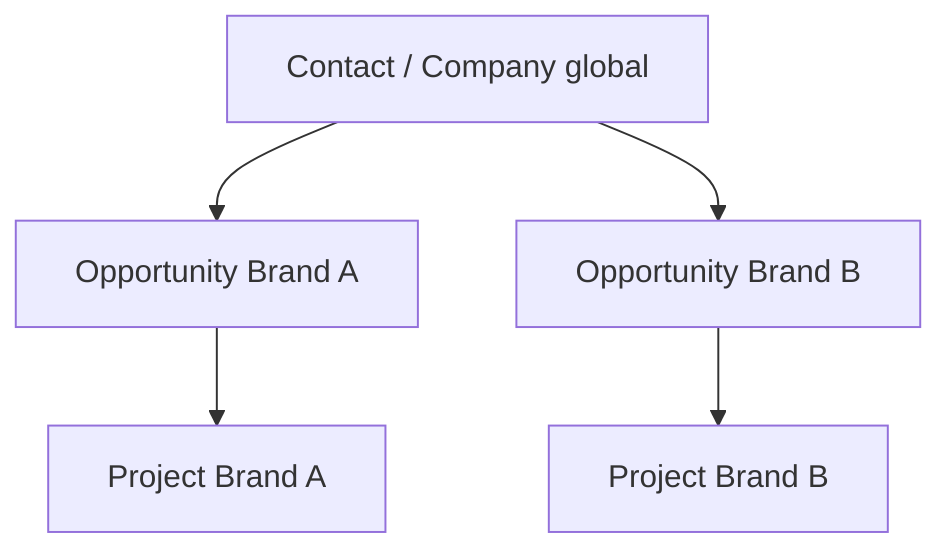
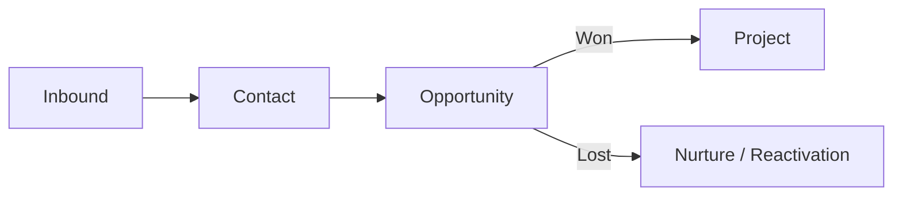
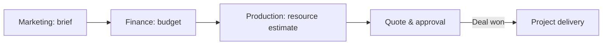

**DOKUMEN 01**

**Product Requirements & Business Process**

Baseline kebutuhan produk untuk CRM multi-brand, finance, production, dan client portal

| **Metadata** | **Keterangan**                                                            |
|--------------|---------------------------------------------------------------------------|
| Produk       | Multi-Brand CRM & Project Operations Platform                             |
| Organisasi   | Perusahaan Multi-Brand                                                    |
| Audiens      | Direktur, Product Owner, Business Analyst, Marketing, Finance, Production |
| Versi        | 1.1 — mencakup corporate SSO `@udp.co.id` dan integrasi email             |
| Tanggal      | 29 Agustus 2026                                                           |
| Status       | Baseline untuk discovery, desain, pengembangan, QA, dan implementasi      |

**CATATAN PENGGUNAAN**

Dokumen ini adalah baseline pembangunan. Nilai legal perusahaan, kebijakan pajak, daftar user, kredensial integrasi, serta detail paket layanan perlu dikonfirmasi pada discovery sebelum production release.

# Kontrol Dokumen

| **Item**         | **Nilai**                                                                                     |
|------------------|-----------------------------------------------------------------------------------------------|
| Pemilik dokumen  | Product Owner / Direktur yang ditunjuk                                                        |
| Cakupan          | Visi produk, proses bisnis, kebutuhan fungsional, aturan bisnis, KPI, dan acceptance criteria |
| Siklus review    | Setiap akhir fase discovery dan sebelum release mayor                                         |
| Sumber kebenaran | Repository dokumentasi proyek dan keputusan arsitektur                                        |
| Perubahan        | Melalui change request dengan pemilik, alasan, dampak, dan approval                           |

## Cara Membaca Paket Ini

- Dokumen 01 menjelaskan apa yang dibangun dan aturan bisnisnya.

- Dokumen 02 menjelaskan bagaimana sistem dibangun, disimpan, diamankan, dan diintegrasikan.

- Dokumen 03 menjelaskan pengalaman pengguna, navigasi, layar, state, dan pola interaksi.

- Dokumen 04 menjelaskan urutan delivery, backlog, pengujian, peluncuran, dan operasional.

# 1. Ringkasan Eksekutif

Platform ini menyatukan lead, komunikasi lintas kanal, aktivitas penjualan, estimasi dan invoicing, pekerjaan produksi, file, timeline, serta portal client dalam satu sumber data. Identitas contact dan perusahaan dikelola secara global; setiap kebutuhan komersial tetap memiliki konteks brand, owner, layanan, nilai, dan pipeline sendiri.

| **KEPUTUSAN INTI** Lead bukan project. Contact/company adalah identitas; opportunity adalah kebutuhan penjualan; project hanya dibuat setelah deal won atau melalui pengecualian yang disetujui. |
|--------------------------------------------------------------------------------------------------------------------------------------------------------------------------------------------------|

## 1.1 Latar Belakang

- Perusahaan memiliki empat brand aktif dengan layanan berbeda dan dapat menambah brand baru.

- Lead berasal dari website, WhatsApp, email, Instagram, referral, event, dan sumber lain.

- Satu calon client dapat berpindah kanal sehingga jejak percakapan mudah terpecah atau dihitung ganda.

- Marketing, Finance, Production, Direktur, dan Client membutuhkan data yang sama dengan tingkat akses berbeda.

- Lead lost perlu alasan terstruktur, peluang reaktivasi, serta penawaran ulang atau cross-sell ke brand yang relevan.

## 1.2 Visi Produk

Menjadi sistem operasi komersial dan delivery perusahaan: setiap lead diketahui asalnya, setiap interaksi terlacak, setiap komitmen memiliki owner dan tenggat, setiap proyek memiliki scope dan margin, serta setiap client memperoleh progress yang transparan sesuai brand.

## 1.3 Sasaran Bisnis

| **Sasaran**                       | **Ukuran awal**                                               | **Target dikonfirmasi saat discovery**           |
|-----------------------------------|---------------------------------------------------------------|--------------------------------------------------|
| Tidak ada lead terlewat           | % lead baru yang assigned dan memiliki first action dalam SLA | Baseline 4 minggu, lalu target per brand/channel |
| Riwayat komunikasi utuh           | % interaction yang tertaut ke contact dan opportunity         | Minimal 95% untuk channel terintegrasi           |
| Forecast lebih akurat             | Selisih weighted pipeline vs revenue aktual                   | Target disepakati Direktur dan Finance           |
| Lost reason actionable            | % lost dengan reason, note, dan reactivation decision         | 100%                                             |
| Handover tanpa kehilangan konteks | % won deal dengan brief, scope, budget, dan owner lengkap     | 100% sebelum produksi mulai                      |
| Transparansi client               | % milestone dengan status dan approval yang dapat diaudit     | 100% project portal-enabled                      |

## 1.4 Non-goals Fase Awal

- Menggantikan software akuntansi penuh/general ledger.

- Mengirim pesan massal tanpa consent, opt-out, dan batas kanal.

- Menyediakan marketplace freelancer/vendor lengkap.

- Mengotomatisasi keputusan harga atau diskon tanpa approval manusia.

- Menggabungkan contact secara permanen tanpa preview dan audit trail.

# 2. Baseline Brand dan Layanan

| **Brand**       | **Positioning/layanan utama**                                                             | **Implikasi workflow**                                                       |
|-----------------|-------------------------------------------------------------------------------------------|------------------------------------------------------------------------------|
| Unimasi         | Animasi company profile, pembelajaran, infografis, produk/program, sosialisasi, marketing | Script, storyboard, asset, animation, sound, revision, delivery              |
| Segia Tech      | Website, SEO, UI/UX, produksi konten                                                      | Discovery, sitemap, design, development, QA, launch/maintenance              |
| Erfo Multimedia | Foto/video dokumentasi, shooting, live streaming, drone, video AI, video 360              | Survey, equipment/crew, production day, post-production, archive             |
| Unicam Studio   | Corporate video, 2D/3D animation, AI video, AR/VR, virtual tour, immersive experience     | Consultation, concept, pre-production, production, post-production, revision |

Sumber baseline: unimasi.com, segiatech.com, erfomultimedia.com, dan unicamstudio.com; ditinjau 29 Agustus 2026. Daftar layanan final harus berasal dari master service yang dapat dikonfigurasi.

## 2.1 Prinsip Multi-brand

- Satu database organisasi; data diberi organization_id dan brand scope.

- Contact dan company bersifat global agar hubungan lintas brand terlihat.

- Opportunity, quote, invoice, project, template, nomor dokumen, dan portal selalu memiliki brand context.

- User dapat memiliki akses ke satu, beberapa, atau seluruh brand.

- Service catalog, pipeline, currency, tax, SLA, template, dan workflow dapat dikonfigurasi per brand.

- Cross-sell membuat opportunity terkait, bukan memindahkan atau menimpa opportunity awal.

*Gambar 1. Identitas client global dengan opportunity dan delivery yang tetap terpisah per brand.*

# 3. Pengguna, Role, dan Tanggung Jawab

| **Role**    | **Tanggung jawab**                                                              | **Batas penting**                                 |
|-------------|---------------------------------------------------------------------------------|---------------------------------------------------|
| Super Admin | Konfigurasi organisasi/brand, user, permission, integration, master data, audit | Tidak otomatis menjadi pemilik lead               |
| Direktur    | Monitoring, planning, forecast, target, approval, feedback lintas fungsi        | Akses global sesuai kebijakan organisasi          |
| Marketing   | Triage inbox, qualification, komunikasi, follow-up, proposal, handover          | Dibatasi brand dan record ownership               |
| Finance     | Budget, cost, quote, invoice, tax, payment, receivable, profitability           | Data client/project; biaya sensitif field-level   |
| Production  | Brief, estimate kebutuhan, resource, timeline, milestone, task, deliverable     | Tidak otomatis melihat margin perusahaan          |
| Client      | Brief, timeline, progress, file, approval, revision, invoice miliknya           | Company/project sendiri; tanpa internal note/cost |

## 3.1 Role Tambahan yang Disarankan

- Sales/Marketing Lead untuk assignment, coaching, approval tertentu, dan dashboard tim.

- Project Manager untuk handover, scope, timeline, risiko, dan komunikasi delivery.

- Production Lead untuk kapasitas, estimasi resource, dan quality gate.

- Finance Approver untuk approval diskon, margin minimum, refund, dan credit note.

- External Vendor/Collaborator sebagai role terbatas pada task/file tertentu bila dibutuhkan di fase lanjut.

## 3.2 Akses Staf dengan Email Perusahaan

- Semua user internal wajib masuk melalui identitas perusahaan dengan alamat email berakhiran tepat `@udp.co.id`.

- Pemeriksaan domain tidak cukup hanya dari teks email. Sistem harus memverifikasi identitas melalui penyedia SSO/OIDC perusahaan dan tenant yang telah disetujui.

- Akun staf hanya aktif bila berstatus `ACTIVE`, memiliki membership organisasi, serta sedikitnya satu role dan brand scope.

- Pembuatan akun menggunakan invitation atau sinkronisasi direktori. Login pertama tidak boleh otomatis memberi role maupun akses seluruh brand.

- Super Admin mengatur role, brand scope, department, status, serta tanggal berakhir akses. Perubahan hak akses wajib masuk audit log.

- Client menggunakan area login terpisah dan tetap bersifat invitation-only. Domain `@udp.co.id` tidak digunakan sebagai aturan akses client.

- Spesifikasi lengkap autentikasi dan integrasi mailbox tersedia di [Dokumen 05 — Email & Corporate SSO](05_Email_Corporate_SSO_Integration_UDP.md).

# 4. Domain dan Siklus Hidup End-to-End

*Gambar 2. Alur objek utama; activity log dan audit trail mengikuti seluruh tahapan.*

| **Objek**       | **Tujuan**                                        | **Kapan dibuat**                                       |
|-----------------|---------------------------------------------------|--------------------------------------------------------|
| Inbound Item    | Unit pesan/form/call yang belum selesai di-triage | Saat webhook, email, form, atau input manual masuk     |
| Contact         | Identitas orang global                            | Saat identity match tidak menemukan contact yang valid |
| Company         | Identitas organisasi client                       | Saat diketahui atau dibutuhkan untuk transaksi         |
| Opportunity     | Kebutuhan komersial brand/service                 | Saat kebutuhan layak ditangani atau dicatat            |
| Interaction     | Jejak pesan/call/meeting/note                     | Setiap komunikasi atau aktivitas                       |
| Quote           | Penawaran scope dan harga berversi                | Setelah estimasi disetujui                             |
| Deal/Contract   | Kesepakatan komersial                             | Saat persetujuan/PO/kontrak diterima                   |
| Project         | Unit delivery dan produksi                        | Otomatis saat won atau melalui approval pengecualian   |
| Invoice/Payment | Tagihan dan penerimaan                            | Menurut term pembayaran                                |

# 5. Lead Capture, Inbox, dan Identity Resolution

## 5.1 Sumber Lead

| **Sumber**            | **Data minimum**                                                          | **Metode capture**                |
|-----------------------|---------------------------------------------------------------------------|-----------------------------------|
| Website               | Form, page, UTM, referrer, timestamp, consent                             | Webhook/API per website/brand     |
| WhatsApp              | External contact ID, nomor, message ID, body, attachment, delivery status | Provider resmi dan webhook        |
| Email                 | From/to/cc, subject, thread/message ID, body, attachment                  | Shared mailbox/provider API       |
| Instagram             | Profile/channel ID, message/comment context, timestamp                    | Meta integration sesuai izin akun |
| Manual/Referral/Event | Source detail, introducer/campaign, contact, note                         | Form internal                     |
| Import                | Mapped columns, source file, import batch, validation result              | Controlled CSV import             |

## 5.2 Aturan Penyatuan Identitas

- Normalisasi nomor ke format E.164; simpan raw value untuk audit.

- Lowercase dan trim email; validasi format; jangan menganggap shared mailbox sebagai satu individu tanpa review.

- External channel ID adalah identity key untuk akun/channel tersebut.

- Exact match boleh auto-link jika tidak ada konflik; fuzzy match hanya memberikan kandidat.

- Merge contact harus menampilkan field conflict, destination record, interaction count, dan opportunity terdampak.

- Merge bersifat audited dan reversible oleh role berwenang.

| **LARANGAN** Nama yang mirip tidak cukup untuk auto-merge. Sistem harus memprioritaskan false positive rendah karena salah gabung berisiko membocorkan informasi client. |
|--------------------------------------------------------------------------------------------------------------------------------------------------------------------------|

## 5.3 SLA Inbox

| **Kondisi**                          | **Timer**                | **Escalation**                                |
|--------------------------------------|--------------------------|-----------------------------------------------|
| Lead baru belum assigned             | Mulai saat diterima      | Marketing Lead lalu Direktur sesuai SLA brand |
| Assigned tetapi belum first response | Mulai saat assigned      | Owner reminder, team lead escalation          |
| Client membalas                      | Mulai saat inbound reply | Prioritas inbox meningkat                     |
| Next action overdue                  | Mulai setelah due time   | Owner dan supervisor                          |

# 6. Sales Pipeline

| **Stage**         | **Makna**                  | **Exit criteria**                                     | **Next**                 |
|-------------------|----------------------------|-------------------------------------------------------|--------------------------|
| NEW               | Lead baru                  | Owner assigned, source dan brand diketahui            | CONTACT_ATTEMPTED        |
| CONTACT_ATTEMPTED | Upaya kontak dicatat       | Minimal satu interaction dan outcome                  | CONNECTED / DISQUALIFIED |
| CONNECTED         | Client merespons           | Contact identity diverifikasi                         | QUALIFIED / NURTURE      |
| QUALIFIED         | Kebutuhan layak            | Need, timeline, authority, budget signal, next action | DISCOVERY                |
| DISCOVERY         | Brief digali               | Brief minimum dan meeting summary                     | ESTIMATION               |
| ESTIMATION        | Scope/cost disusun         | Production input dan finance check                    | PROPOSAL_SENT            |
| PROPOSAL_SENT     | Proposal dikirim           | Quote version, sent_at, validity                      | NEGOTIATION              |
| NEGOTIATION       | Scope/harga dinegosiasikan | Decision log dan next action                          | VERBAL_AGREEMENT / LOST  |
| VERBAL_AGREEMENT  | Persetujuan awal           | PO/contract/DP plan                                   | WON / LOST               |
| WON               | Kesepakatan final          | Handover checklist lengkap                            | PROJECT                  |
| LOST              | Tidak berhasil             | Lost reason, note, reactivation decision              | NURTURE / CLOSED         |
| NURTURE           | Belum siap                 | Reason, cadence, consent, next date                   | REACTIVATED / CLOSED     |

## 6.1 Qualification dan Lead Score

Lead score membantu prioritas, bukan menggantikan keputusan marketing. Score harus menjelaskan komponen dan dapat dioverride dengan alasan.

| **Dimensi** | **Contoh sinyal**                           | **Bobot awal** |
|-------------|---------------------------------------------|----------------|
| Fit         | Industri, lokasi, ukuran, kecocokan service | 0-25           |
| Need        | Masalah jelas, deliverable relevan          | 0-25           |
| Authority   | Pengambil keputusan/akses ke decision maker | 0-15           |
| Budget      | Rentang realistis atau procurement path     | 0-15           |
| Timeline    | Deadline dan urgensi                        | 0-10           |
| Engagement  | Response, meeting, asset/brief diberikan    | 0-10           |

Kategori awal: Hot 75-100, Warm 50-74, Cold 0-49. Nilai dan threshold harus configurable per brand/service setelah data historis mencukupi.

# 7. Lost, Nurture, dan Cross-sell

| **Lost reason**      | **Data tambahan**                          | **Reactivation default**                  |
|----------------------|--------------------------------------------|-------------------------------------------|
| Harga                | Budget range, last offer, discount history | 30-90 hari atau paket alternatif          |
| Tidak ada budget     | Budget cycle dan fiscal period             | Menjelang budget cycle                    |
| Kompetitor           | Nama kompetitor dan faktor keputusan       | Saat kebutuhan baru atau contract renewal |
| Timeline tidak cocok | Deadline dan capacity conflict             | Jika jadwal berubah                       |
| Tidak respons        | Jumlah attempt, kanal, last response       | Cadence terbatas lalu dormant             |
| Scope tidak cocok    | Gap layanan                                | Cross-sell ke brand/service relevan       |
| Ditunda              | Alasan dan tanggal review                  | Tanggal yang disepakati                   |
| Invalid/duplicate    | Bukti validasi atau target record          | Tidak di-nurture                          |

- Lost memerlukan reason_code, reason_note, lost_at, lost_by, competitor opsional, dan reactivation_eligibility.

- Nurture memerlukan consent/legitimate basis, channel, cadence, owner, next_contact_at, dan exit condition.

- Cross-sell membuat opportunity baru yang linked_to_opportunity_id dan menyimpan alasan rekomendasi.

- Satu lead tidak boleh menerima sequence paralel yang saling bertabrakan tanpa warning.

# 8. Follow-up Sequence dan Template

| **Komponen** | **Requirement**                                                           |
|--------------|---------------------------------------------------------------------------|
| Sequence     | Brand, service, segment, language, trigger, steps, stop conditions, owner |
| Step         | Delay, business hours, channel, template, task/auto-draft, approval rule  |
| Template     | Version, language, variables, preview, approval status, effective dates   |
| Execution    | Planned/sent/skipped/failed/replied; provider/message ID; actor           |
| Stop rules   | Reply, meeting booked, stage changed, opt-out, lost invalid, manual stop  |
| Analytics    | Sent, delivered, response, meeting, conversion, opt-out per version       |

## 8.1 Variable Standar

- contact_name, company_name, job_title, country, language

- brand_name, service_name, marketing_name, marketing_contact

- last_topic, next_action, meeting_link, proposal_link, proposal_valid_until

- project_value_display dan currency hanya jika user memiliki permission.

| **SAFETY** Fase awal menghasilkan task dan draft yang diperiksa manusia. Auto-send hanya aktif setelah channel compliance, template approval, consent, quiet hours, rate limit, dan stop rules teruji. |
|--------------------------------------------------------------------------------------------------------------------------------------------------------------------------------------------------------|

# 9. Commercial, Budgeting, dan Finance

*Gambar 3. Collaboration loop sebelum penawaran dan setelah deal.*

| **Area**      | **Requirement utama**                                                               |
|---------------|-------------------------------------------------------------------------------------|
| Estimation    | Range awal, confidence, assumptions, currency, validity                             |
| Cost budget   | Internal labor, vendor, equipment, travel, talent, software, contingency, tax       |
| Pricing       | Markup/margin, management fee, discount, rounding, approval threshold               |
| Quote         | Versioning, scope, exclusion, term, tax, currency, validity, approval, delivery log |
| Invoice       | Brand numbering, tax, DP/termin/final, due date, status, bilingual template         |
| Payment       | Amount, currency, date, method, reference, proof, allocation, verification          |
| Receivable    | Outstanding, aging bucket, reminder, dispute, write-off approval                    |
| Profitability | Quoted revenue, actual revenue, budget cost, actual cost, gross margin              |

## 9.1 Formula Baseline

- Subtotal = sum(quantity x unit_price) sebelum discount/tax.

- Net before tax = subtotal - discount + non-taxable fee sesuai konfigurasi.

- Tax = taxable_base x applicable_tax_rate; aturan pajak dikonfirmasi Finance/legal.

- Gross margin = (recognized revenue - actual direct cost) / recognized revenue.

- Weighted pipeline = opportunity expected value x probability; currency dikonversi memakai snapshot rate bertanggal.

# 10. Production dan Project Delivery

## 10.1 Handover Gate

| **Wajib sebelum project aktif**             | **Pemilik**                 |
|---------------------------------------------|-----------------------------|
| Approved scope/deliverables dan exclusions  | Marketing + Client/Approver |
| Client brief dan asset awal                 | Marketing + Production      |
| Budget/quotation version yang disetujui     | Finance                     |
| Payment term dan status prerequisite        | Finance                     |
| Project manager, production lead, team awal | Production                  |
| Target timeline dan risk awal               | Production + Marketing      |
| Client portal contacts dan visibility       | Project Manager             |

## 10.2 Kapabilitas Delivery

- Project template per service dengan phase, milestone, task, dependency, checklist, dan default duration.

- Timeline/Gantt, workload dan resource availability.

- Internal brief terpisah dari client-visible brief.

- File version, deliverable package, preview, checksum, access, expiry, dan download log.

- Revision round dengan requester, reason, scope impact, due date, owner, dan resolution.

- Change request dengan perubahan scope, biaya, timeline, approval, dan invoice tambahan.

- Risk/issue log, decision log, meeting note, dan escalation.

# 11. Client Portal

| **Area portal** | **Terlihat client**                            | **Tidak terlihat**              |
|-----------------|------------------------------------------------|---------------------------------|
| Overview        | Status, progress, next milestone, contacts     | Internal health score           |
| Brief           | Approved brief dan client inputs               | Internal strategy/note          |
| Timeline        | Milestone, due date, status, dependency client | Internal task sensitif          |
| Files           | Deliverable, preview, version, approval        | Working files dan vendor asset  |
| Revision        | Request, response, status, included rounds     | Internal cost discussion        |
| Commercial      | Quote/contract/invoice/payment milik company   | Margin, cost, forecast internal |
| Communication   | Comment yang ditandai client-visible           | Internal note/mention           |

- Portal mengambil logo, warna, sender identity, dan template dari brand project.

- Client user dapat dihubungkan ke beberapa project dalam company yang sama sesuai invitation scope.

- Approval harus menyimpan actor, timestamp, version, IP/device metadata yang sesuai kebijakan, dan optional comment.

- Revocation akses berlaku segera dan tidak menghapus audit history.

# 12. Dashboard, KPI, dan Reporting

| **Metric**          | **Definisi**                              | **Catatan**                              |
|---------------------|-------------------------------------------|------------------------------------------|
| First response time | first_outbound_at - inbound_received_at   | Brand, channel, owner, business hours    |
| Lead conversion     | qualified/won count dibagi eligible leads | Definisi cohort harus konsisten          |
| Win rate            | won / (won + lost)                        | By close period dan brand/service        |
| Sales cycle         | won_at - opportunity_created_at           | Median lebih tahan outlier               |
| Pipeline value      | Sum open expected value                   | Native currency dan reporting currency   |
| Weighted pipeline   | Sum value x probability                   | Probability manual/model harus dibedakan |
| Lost reason share   | lost per reason / all lost                | Trend dan brand/service                  |
| Follow-up adherence | completed on time / due tasks             | Business hours aware                     |
| Quote-to-win        | won quotes / sent quotes                  | Gunakan final opportunity outcome        |
| Project on-time     | milestone on time / completed milestone   | Exclude approved date changes            |
| Gross margin        | (revenue - direct cost) / revenue         | Finance-only detail                      |
| DSO/aging           | Outstanding berdasarkan due date          | Bucket 0-30/31-60/61-90/90+              |

## 12.1 Dashboard per Role

| **Role**   | **Kartu utama**                                                                   |
|------------|-----------------------------------------------------------------------------------|
| Direktur   | Revenue/forecast, funnel, lost, performance, capacity, margin, receivable, risks  |
| Marketing  | Inbox, SLA, pipeline, next actions, overdue, proposal status, personal conversion |
| Finance    | Estimate queue, approvals, invoicing, payment, aging, margin variance             |
| Production | Handover queue, workload, milestones, blockers, revision, budget usage            |
| Client     | Project status, next input, approvals, files, invoice/payment                     |

# 13. Kebutuhan Fungsional

| **ID**        | **Prioritas** | **Requirement**                                                                      |
|---------------|---------------|--------------------------------------------------------------------------------------|
| FR-ORG-001    | P0            | Super Admin dapat membuat dan menonaktifkan brand tanpa deployment kode.             |
| FR-ORG-002    | P0            | Brand memiliki identity, service, pipeline, numbering, currency, tax, template, SLA. |
| FR-IAM-001    | P0            | Permission dievaluasi berdasarkan role, brand, ownership, action, dan field.         |
| FR-IAM-002    | P0            | Client hanya dapat mengakses company/project yang diundang.                          |
| FR-LEAD-001   | P0            | Sistem membuat inbound item dari form/manual channel dan menjaga source metadata.    |
| FR-LEAD-002   | P0            | Marketing dapat assign, claim, merge suggestion, qualify, disqualify, dan convert.   |
| FR-ID-001     | P0            | Nomor, email, dan channel identity dinormalisasi sebelum matching.                   |
| FR-ID-002     | P0            | Merge menyediakan preview conflict, audit, dan undo oleh role berwenang.             |
| FR-INT-001    | P0            | Interaction timeline menyimpan pesan, call, meeting, note, attachment, dan actor.    |
| FR-PIPE-001   | P0            | Pipeline dapat dikonfigurasi per brand dan dipetakan ke canonical stage.             |
| FR-PIPE-002   | P0            | Perubahan stage memvalidasi exit criteria dan mencatat history.                      |
| FR-LOST-001   | P0            | Lost memerlukan reason, note, dan reactivation decision.                             |
| FR-FU-001     | P0            | User dapat membuat task, next action, reminder, dan follow-up outcome.               |
| FR-FU-002     | P1            | Admin dapat membuat sequence dan template versioned multibahasa.                     |
| FR-COM-001    | P0            | Marketing, Production, Finance berkolaborasi pada estimation berstatus.              |
| FR-QUOTE-001  | P0            | Quote mendukung version, line item, tax, discount, approval, validity, PDF.          |
| FR-INV-001    | P0            | Invoice mendukung DP/termin/final, allocation, outstanding, dan status.              |
| FR-PAY-001    | P0            | Finance mencatat/verifikasi payment dan mengalokasikannya ke invoice.                |
| FR-PROJ-001   | P0            | Won deal dapat menghasilkan project melalui handover gate.                           |
| FR-PROJ-002   | P0            | Project memiliki phase, milestone, task, dependency, file, revision, risk.           |
| FR-CR-001     | P1            | Change request memuat dampak scope, timeline, price, approval, dan status.           |
| FR-PORTAL-001 | P0            | Client portal hanya menampilkan field dan file client-visible.                       |
| FR-PORTAL-002 | P0            | Client approval mengikat version tertentu dan tercatat audit.                        |
| FR-RPT-001    | P0            | Dashboard menerapkan filter waktu, brand, service, channel, owner, country.          |
| FR-AUD-001    | P0            | Create/update/delete/merge/approval/export/login tercatat di audit log.              |
| FR-AUTH-001   | P0            | User staf hanya dapat login melalui SSO tenant perusahaan menggunakan email aktif `@udp.co.id`. |
| FR-AUTH-002   | P0            | Login tidak otomatis memberikan role; akses efektif berasal dari membership, role, dan brand scope. |
| FR-EMAIL-001  | P0            | Email inbound dan outbound dari mailbox brand tercatat sebagai interaction pada timeline lead. |
| FR-EMAIL-002  | P0            | Sistem mempertahankan Message-ID, thread, sender, recipient, attachment, delivery, bounce, dan audit metadata. |
| FR-EXP-001    | P1            | Export mengikuti permission, filter, watermarked metadata, dan audit.                |

# 14. Non-functional Requirements

| **Area**      | **Baseline**                                                                               |
|---------------|--------------------------------------------------------------------------------------------|
| Security      | OWASP controls, MFA untuk privileged roles, encrypted transport/storage, secret management |
| Authorization | Deny by default; server-side checks; test cross-brand dan client isolation                 |
| Auditability  | Append-oriented event, actor/time/source/before-after, retention policy                    |
| Availability  | Target ditentukan discovery; graceful degradation saat channel provider down               |
| Performance   | P95 internal navigation \<2.5s pada target dataset; inbox/filter pagination server-side    |
| Scalability   | Queue-based ingestion, idempotent webhook, horizontal workers, indexed search              |
| Reliability   | Retry with backoff, dead-letter queue, reconciliation jobs, backup/restore drill           |
| Accessibility | Keyboard navigation, visible focus, WCAG AA contrast, semantic labels                      |
| Localization  | Bahasa ID/EN, timezone-aware, currency/number/date locale                                  |
| Observability | Structured log, traces, metrics, alert, correlation ID, integration health                 |
| Privacy       | Consent/opt-out, minimization, retention, export/delete request workflow                   |
| Compatibility | Latest stable desktop/mobile browsers; portal responsive                                   |

# 15. Business Rules dan Approval

| **Rule** | **Kondisi**                                              | **Enforcement**            |
|----------|----------------------------------------------------------|----------------------------|
| BR-001   | Opportunity tidak boleh Won tanpa handover gate          | Block + exception approval |
| BR-002   | Lost wajib reason dan reactivation decision              | Block transition           |
| BR-003   | Quote sent harus approved sesuai threshold               | Block send/download final  |
| BR-004   | Discount/margin melewati batas                           | Finance/Director approval  |
| BR-005   | Client file hanya version approved untuk visibility      | Server-side access         |
| BR-006   | Cross-brand transfer tidak menghapus origin attribution  | Immutable source fields    |
| BR-007   | Template auto-send harus approved dan aktif              | Job precondition           |
| BR-008   | Contact merge tidak boleh lintas conflict unresolved     | Manual review              |
| BR-009   | Invoice issued tidak diedit diam-diam                    | Revision/credit note flow  |
| BR-010   | Stage probability default dapat dioverride dengan alasan | History + audit            |

# 16. Acceptance Criteria per Epic

| **Epic**      | **Acceptance outcome**                                                                                          |
|---------------|-----------------------------------------------------------------------------------------------------------------|
| Multi-brand   | Brand baru dapat dibuat, diberi service/pipeline/template, dan diakses user terpilih tanpa code change.         |
| Inbox         | Inbound item tampil sekali, membawa source metadata, SLA, dedup suggestion, dan dapat ditautkan ke opportunity. |
| Timeline      | Pesan lintas kanal tersusun kronologis, dapat difilter, dan setiap item memiliki source/actor.                  |
| Pipeline      | Drag/drop atau stage change memvalidasi permission/exit criteria dan memperbarui forecast/history.              |
| Lost/nurture  | Lost reason wajib; eligible lead mendapat next contact; opt-out menghentikan seluruh sequence.                  |
| Quote/finance | Perhitungan konsisten, version immutable setelah issued, approval dan delivery tercatat.                        |
| Project       | Won handover membuat project dari template tanpa kehilangan brief, quote, contacts, dan brand.                  |
| Portal        | Client A tidak dapat mengakses URL/file Client B; approval terkait version yang benar.                          |
| Audit         | Admin dapat menelusuri perubahan critical record dan export event berdasarkan permission.                       |
| Reporting     | Angka dashboard dapat direkonsiliasi ke record sumber dan definisi metric terdokumentasi.                       |

# 17. Asumsi, Dependensi, dan Keputusan Terbuka

| **ID** | **Topik**       | **Keputusan yang dibutuhkan**                                 | **Owner**            |
|--------|-----------------|---------------------------------------------------------------|----------------------|
| OD-01  | Legal entity    | Apakah invoice/contract per brand atau satu badan hukum?      | Direktur + Finance   |
| OD-02  | WhatsApp        | Nomor/provider per brand dan kebijakan shared inbox           | Marketing + IT       |
| OD-03  | Email           | Mailbox/domain yang akan diintegrasikan dan retention         | Admin + Marketing    |
| OD-04  | Instagram       | Akun bisnis, permission, dan jenis interaction yang dicapture | Marketing            |
| OD-05  | Currency        | Reporting currency, exchange rate source, recognition policy  | Finance              |
| OD-06  | Tax             | Pajak dan numbering invoice/quote sesuai badan hukum          | Finance/Tax          |
| OD-07  | Client files    | Batas ukuran, retention, watermark, download policy           | Production + IT      |
| OD-08  | SLA             | Jam kerja, holiday calendar, target per channel/brand         | Director + Marketing |
| OD-09  | Historical data | Sumber, kualitas, volume, dan dedup rules migrasi             | Product Owner        |
| OD-10  | Approval        | Threshold discount, margin, budget variance, refund           | Director + Finance   |

# 18. Glosarium

| **Istilah**     | **Definisi**                                                        |
|-----------------|---------------------------------------------------------------------|
| Lead            | Sinyal atau calon kebutuhan yang belum sepenuhnya qualified.        |
| Contact         | Orang yang berinteraksi dengan perusahaan.                          |
| Company/Account | Organisasi yang terkait dengan satu atau lebih contact/opportunity. |
| Opportunity     | Kebutuhan komersial untuk brand/service tertentu.                   |
| Interaction     | Pesan, call, meeting, note, atau aktivitas lain.                    |
| Deal            | Opportunity yang mencapai kesepakatan komersial.                    |
| Project         | Unit delivery setelah handover.                                     |
| Sequence        | Rangkaian follow-up terjadwal dengan stop rules.                    |
| Nurture         | Pemeliharaan hubungan untuk lead yang belum siap membeli.           |
| Canonical stage | Stage standar untuk reporting lintas brand.                         |
| Client-visible  | Data/file/comment yang boleh ditampilkan di portal.                 |
