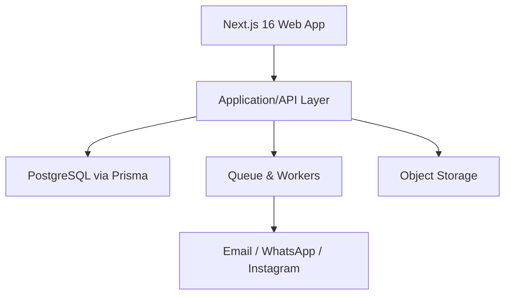
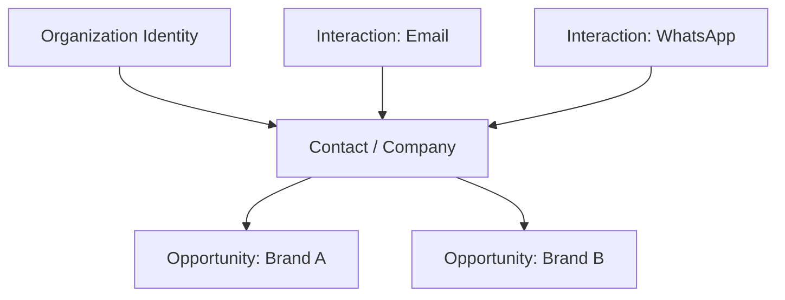
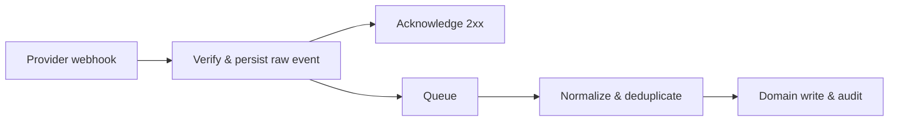

**DOKUMEN 02**

**Technical Architecture & Data Specification**

Arsitektur aplikasi, data model, API, integrasi, security, observability, dan deployment

| **Metadata** | **Keterangan**                                                       |
|--------------|----------------------------------------------------------------------|
| Produk       | Multi-Brand CRM & Project Operations Platform                        |
| Organisasi   | Perusahaan Multi-Brand                                               |
| Audiens      | Tech Lead, Backend, Frontend, DevOps, Security, Data/BI, QA          |
| Versi        | 1.1 — mencakup corporate SSO `@udp.co.id` dan integrasi email        |
| Tanggal      | 29 Agustus 2026                                                      |
| Status       | Baseline untuk discovery, desain, pengembangan, QA, dan implementasi |

**CATATAN PENGGUNAAN**

Dokumen ini adalah baseline pembangunan. Nilai legal perusahaan, kebijakan pajak, daftar user, kredensial integrasi, serta detail paket layanan perlu dikonfirmasi pada discovery sebelum production release.

# Kontrol Dokumen

| **Item**         | **Nilai**                                                                                              |
|------------------|--------------------------------------------------------------------------------------------------------|
| Pemilik dokumen  | Product Owner / Direktur yang ditunjuk                                                                 |
| Cakupan          | Arsitektur target Next.js 16, PostgreSQL/Prisma, domain model, integrasi, security, dan operasi teknis |
| Siklus review    | Setiap akhir fase discovery dan sebelum release mayor                                                  |
| Sumber kebenaran | Repository dokumentasi proyek dan keputusan arsitektur                                                 |
| Perubahan        | Melalui change request dengan pemilik, alasan, dampak, dan approval                                    |

## Cara Membaca Paket Ini

- Dokumen 01 menjelaskan apa yang dibangun dan aturan bisnisnya.

- Dokumen 02 menjelaskan bagaimana sistem dibangun, disimpan, diamankan, dan diintegrasikan.

- Dokumen 03 menjelaskan pengalaman pengguna, navigasi, layar, state, dan pola interaksi.

- Dokumen 04 menjelaskan urutan delivery, backlog, pengujian, peluncuran, dan operasional.

# 1. Architecture Summary

Target yang disarankan adalah modular monolith untuk fase awal: satu aplikasi Next.js dengan domain modules yang tegas, worker terpisah untuk pekerjaan asynchronous, PostgreSQL sebagai system of record, object storage untuk file, dan provider adapters untuk kanal. Pendekatan ini mengurangi beban operasional tanpa mengorbankan batas domain atau jalan menuju service extraction.

| **KEPUTUSAN DATA** Gunakan PostgreSQL di production. SQLite hanya layak untuk demo lokal; workload multi-user, webhook bersamaan, ledger keuangan, audit, dan reporting memerlukan concurrency serta kontrol transaksi yang lebih kuat. |
|-----------------------------------------------------------------------------------------------------------------------------------------------------------------------------------------------------------------------------------------|

*Gambar 1. Arsitektur logis dan dependency direction platform.*

# 2. Technology Baseline

| **Layer**     | **Pilihan awal**                                  | **Alasan/constraint**                                                 |
|---------------|---------------------------------------------------|-----------------------------------------------------------------------|
| Web framework | Next.js 16 + TypeScript                           | App Router; server/client boundary eksplisit; pinned version          |
| UI            | React + accessible component system               | Design tokens dan reusable patterns                                   |
| API           | Route handlers/server actions terkontrol          | Domain service tetap reusable dan testable                            |
| Database      | PostgreSQL                                        | Transactions, concurrency, indexing, JSONB, extensions bila disetujui |
| ORM           | Prisma                                            | Schema/migration/type safety; raw SQL hanya ter-review                |
| Queue         | Redis-backed queue atau managed equivalent        | Webhook processing, retry, scheduled follow-up                        |
| Files         | S3-compatible object storage                      | Signed URL, version, lifecycle, large file                            |
| Email         | Provider API + inbound webhook/mailbox adapter    | Thread IDs, delivery, bounce                                          |
| Messaging     | WhatsApp/Meta provider adapters                   | Jangan ikat domain ke satu vendor                                     |
| Auth          | OIDC/session provider dengan MFA support          | Privileged access, client invitations                                 |
| Observability | Structured logs, metrics, tracing, error tracking | Correlation dari webhook sampai record                                |

# 3. System Context dan Trust Boundary

| **Actor/System**      | **Interaksi**             | **Trust rule**                                         |
|-----------------------|---------------------------|--------------------------------------------------------|
| Internal user         | Browser ke internal app   | Authenticated, RBAC, brand scope, CSRF/session control |
| Client user           | Browser ke portal         | Invitation scope, company/project isolation            |
| Brand website         | Submit lead webhook/API   | Signed request, rate limit, idempotency                |
| Channel provider      | Inbound/outbound messages | Signature validation, external ID uniqueness           |
| Payment/bank evidence | Manual/API payment input  | Finance verification dan audit                         |
| Object storage        | File upload/download      | Short-lived signed URL, scoped object key              |
| Analytics/reporting   | Read model/export         | Row/field permission dan data minimization             |

# 4. Modular Architecture

| **Module**         | **Ownership**                                                 |
|--------------------|---------------------------------------------------------------|
| identity-access    | User, role, permission, membership, session, invitation       |
| organization-brand | Organization, brand, service catalog, configuration           |
| crm                | Contact, company, identity, lead inbox, opportunity, pipeline |
| interaction        | Conversation, message, call, meeting, note, attachment        |
| automation         | Sequence, template, scheduled step, task, notification        |
| commercial         | Estimate, budget, quote, approval, deal/contract              |
| finance            | Invoice, payment, allocation, expense, exchange rate          |
| projects           | Project, phase, milestone, task, resource, risk, revision     |
| portal             | Client projection, approvals, comments, downloads             |
| reporting          | Metric definitions, snapshots, exports, dashboards            |
| integrations       | Provider adapters, webhooks, sync cursors, health             |
| audit              | Audit event, domain event, export/security events             |

- UI tidak menulis database langsung; semua mutation melewati application service dan authorization.

- Satu module tidak mengakses tabel module lain secara ad hoc; gunakan service contract atau event.

- Domain event diterbitkan setelah transaction commit melalui outbox pattern.

- Provider-specific payload disimpan terpisah dari normalized domain fields.

# 5. Multi-Brand Data Scoping

*Gambar 2. Pemisahan identitas global, opportunity brand-scoped, dan interaction lintas kanal.*

| **Scope**           | **Contoh entity**                              | **Rule**                                                          |
|---------------------|------------------------------------------------|-------------------------------------------------------------------|
| Organization-global | User, role definition, company, contact        | Bisa terlihat lintas brand hanya jika permission mengizinkan      |
| Brand-scoped        | Opportunity, pipeline, quote, invoice, project | brand_id wajib dan immutable setelah issued kecuali transfer flow |
| Record-scoped       | Task, note, file, comment                      | Mewarisi scope parent dan visibility classification               |
| Client-scoped       | Portal membership, approval, download          | company/project allow-list eksplisit                              |
| Provider-scoped     | Channel account, external identity, webhook    | Unique per provider account + external ID                         |

# 6. Authorization Model

Authorization dievaluasi server-side menggunakan policy: subject + action + resource + context. UI boleh menyembunyikan action, tetapi keputusan final tetap di server.

## 6.1 Corporate SSO untuk Staf UDP

| Area | Keputusan teknis |
|---|---|
| Protokol | OIDC Authorization Code + PKCE; provider adapter untuk Google Workspace atau Microsoft Entra ID |
| Domain | Klaim email harus berakhiran tepat `@udp.co.id`; domain alias tidak diterima tanpa konfigurasi eksplisit |
| Tenant | `iss`, `aud`, dan tenant/provider ID harus cocok dengan allowlist konfigurasi server |
| Verifikasi | `email_verified=true` atau ekuivalen provider; jangan mempercayai email dari request client |
| Provisioning | Invitation/JIT terkontrol; user baru dibuat `PENDING` sampai membership dan role ditetapkan |
| Session | Cookie `HttpOnly`, `Secure`, `SameSite=Lax/Strict` sesuai flow; rotasi session setelah login dan privilege change |
| MFA | Wajib di identity provider untuk Super Admin, Direktur, Finance Approver, dan role privileged |
| Deprovision | Akun disabled di IdP atau CRM menyebabkan session aktif dicabut dan akses berikutnya ditolak |
| Client realm | Login portal client dipisahkan dari staf, dengan invitation dan scope company/project |

Validasi akses staf dilakukan berurutan: signature token, issuer, audience, nonce/state, tenant, verified email, domain, user status, membership, lalu authorization policy. Domain email tidak pernah menjadi pengganti role.

| **Dimensi** | **Contoh**                                                       |
|-------------|------------------------------------------------------------------|
| Subject     | user_id, roles, department, memberships, client memberships      |
| Action      | view, create, edit, delete, assign, approve, export, send, merge |
| Resource    | entity type, organization_id, brand_id, owner_id, company_id     |
| Context     | record status, amount threshold, client_visible, environment     |
| Field       | cost detail, margin, tax identity, internal note, personal data  |

## 6.1 Permission Examples

| **Policy**                                        | **Expected result**                                   |
|---------------------------------------------------|-------------------------------------------------------|
| Marketing views opportunity in assigned brand     | Allow; cost/margin fields redacted                    |
| Production edits approved quote                   | Deny; create estimation input/change request instead  |
| Finance issues invoice without threshold approval | Deny                                                  |
| Client requests another company file URL          | Deny before URL signing; security event               |
| Director exports all contacts                     | Allow only explicit export permission; audit required |

# 7. Core Data Model

| **Entity**              | **Field utama**                                                        | **Catatan**             |
|-------------------------|------------------------------------------------------------------------|-------------------------|
| Organization            | id, name, default_currency, locale, status                             | Root tenant             |
| Brand                   | organization_id, slug, name, identity, currency, timezone              | Configurable            |
| Service                 | brand_id, category, name, active, workflow_template_id                 | Version/reference       |
| User                    | email, name, status, locale, timezone                                  | Auth subject            |
| Membership              | user_id, organization_id, brand_id?, department                        | Scope                   |
| Role/Permission         | role, action, resource, field, condition                               | Policy inputs           |
| Company                 | organization_id, legal/display name, domain, country, tax              | Global account          |
| Contact                 | organization_id, company_id?, name, title, locale, timezone            | Global person           |
| ContactIdentity         | contact_id, type, normalized_value, raw_value, verified                | Email/phone/social      |
| InboundItem             | channel_account_id, external_id, received_at, payload_ref, status      | Triage queue            |
| LeadSource              | channel, campaign, utm, referrer, introducer                           | Attribution             |
| Opportunity             | brand_id, contact/company, service, owner, stage, value, probability   | Commercial need         |
| OpportunityStageHistory | from/to, actor, reason, occurred_at                                    | Immutable history       |
| Conversation            | brand_id, contact_id, opportunity_id?, channel/thread keys             | Thread grouping         |
| Interaction             | conversation_id, direction, type, body, occurred_at, actor             | Unified timeline        |
| Attachment              | parent type/id, object_key, checksum, mime, visibility                 | File metadata           |
| Task                    | parent, owner, due_at, status, outcome                                 | Next action             |
| Sequence/Step           | brand/service/segment, trigger, delay, channel, stop rules             | Automation definition   |
| Template/Version        | language, variables, content, approval, effective range                | Message/docs            |
| SequenceEnrollment      | opportunity/contact, current_step, state, next_at                      | Execution state         |
| Estimate                | opportunity_id, version, amount range, assumptions, status             | Early value             |
| Budget                  | opportunity/project, version, status, total cost                       | Cost plan               |
| BudgetLine              | category, description, qty, unit, unit_cost, tax                       | Cost input              |
| Quote                   | brand/opportunity, number, version, totals, currency, validity, status | Offer                   |
| QuoteLine               | service, description, qty, unit, price, tax, discount                  | Offer line              |
| Approval                | resource, approver, status, threshold, comment, decided_at             | Generic approval        |
| Contract/Deal           | opportunity, quote, terms, signed/PO metadata                          | Won evidence            |
| Invoice                 | brand/company/project, number, dates, totals, status                   | Receivable              |
| InvoiceLine             | description, qty, unit_price, tax                                      | Invoice detail          |
| Payment                 | company, amount, currency, method, reference, verified                 | Cash receipt            |
| PaymentAllocation       | payment_id, invoice_id, amount                                         | Many-to-many allocation |
| ExchangeRate            | base, quote, rate, source, effective_at                                | Snapshot                |
| Project                 | brand, company, opportunity/deal, manager, status, dates               | Delivery root           |
| ProjectPhase            | project, template key, status, order, dates                            | Delivery stage          |
| Milestone               | phase, title, due, status, visibility, approval                        | Client checkpoint       |
| ProjectTask             | milestone, assignee, dependency, estimate, status                      | Work item               |
| ResourceAssignment      | user/vendor, task/project, allocation, dates                           | Capacity                |
| Revision                | deliverable/version, round, request, scope impact, status              | Feedback cycle          |
| ChangeRequest           | project, scope/time/cost impact, approval, status                      | Controlled change       |
| RiskIssue               | project/opportunity, severity, owner, mitigation, status               | Delivery control        |
| PortalMembership        | user/contact/company, projects, role, expiry                           | Client access           |
| ClientApproval          | resource version, actor, decision, timestamp                           | Evidence                |
| Notification            | recipient, type, payload, read_at, channel                             | User alert              |
| AuditEvent              | actor, action, resource, before/after, context, occurred_at            | Security/audit          |
| DomainEvent/Outbox      | event_type, aggregate, payload, published_at                           | Reliable async          |
| IntegrationConnection   | provider, brand, credentials_ref, config, health                       | Adapter config          |
| WebhookEvent            | provider, external_id, signature, payload_ref, status, attempts        | Idempotent ingress      |

# 8. Data Integrity dan State Machine

| **Invariant**                                             | **Implementation**                                                    |
|-----------------------------------------------------------|-----------------------------------------------------------------------|
| External message tidak diproses dua kali                  | Unique(provider_account_id, external_message_id) + idempotency result |
| Issued quote/invoice tidak berubah diam-diam              | Immutable version; amendment/revision entity                          |
| Payment allocation tidak melebihi payment/invoice balance | Serializable transaction/locking + constraint check                   |
| Project client access terisolasi                          | Membership allow-list + authorization before query/sign URL           |
| Stage history lengkap                                     | Transition service writes current state and history atomically        |
| Audit event tidak hilang                                  | Outbox in same transaction; append store; monitored publisher         |
| Currency tidak berubah historis                           | Store currency and rate snapshot per transaction/reporting event      |

## 8.1 Soft Delete dan Retention

- Operational entities memakai archived_at/deleted_at sesuai policy; financial/audit records tidak di-hard-delete sembarang.

- Personal data deletion memisahkan legal retention dari anonymization/pseudonymization.

- Object storage lifecycle mengikuti attachment retention dan legal hold.

- Restore memerlukan permission dan menghasilkan audit event.

# 9. Identity Resolution Algorithm

| **Langkah**          | **Proses**                                                            | **Output**                                 |
|----------------------|-----------------------------------------------------------------------|--------------------------------------------|
| 1\. Normalize        | Email lower/trim; phone E.164; domain punycode; provider ID canonical | Identity candidates                        |
| 2\. Exact match      | Verified identities dalam organization                                | Auto-link jika satu kandidat tanpa konflik |
| 3\. Context match    | Company domain, channel account, thread, prior opportunity            | Confidence adjustment                      |
| 4\. Fuzzy suggestion | Name/company similarity; transliteration jika relevan                 | Manual review candidates                   |
| 5\. Conflict check   | Identities verified berbeda, privacy/client boundary                  | Block auto-merge                           |
| 6\. Decision         | Link, create, keep separate, merge                                    | Decision/audit record                      |

- Score dan alasan kandidat disimpan agar hasil dapat dijelaskan.

- Manual decision dapat menjadi negative link agar kandidat yang sama tidak terus muncul.

- Merge memindahkan references melalui transaction, mempertahankan source IDs, dan membuat merge snapshot untuk undo.

# 10. API Contract

## 10.1 Conventions

- Base path /api/v1; JSON; timestamps ISO 8601 UTC; display menggunakan user timezone.

- ID menggunakan UUID/CUID yang tidak sequential di URL publik.

- Pagination cursor-based untuk inbox/timeline; offset hanya untuk admin lookup kecil.

- Idempotency-Key wajib untuk create payment, send message, issue invoice, dan external webhook.

- Error berbentuk code, message, field_errors, correlation_id; tidak membocorkan stack/PII.

- Optimistic concurrency melalui version/updated_at untuk record yang sering diedit.

| **Method** | **Endpoint**                   | **Purpose**                          |
|------------|--------------------------------|--------------------------------------|
| POST       | /inbound/webhooks/{provider}   | Terima signed event; enqueue         |
| GET        | /inbox                         | List inbound items dengan filter/SLA |
| POST       | /inbox/{id}/resolve            | Link/create contact/opportunity      |
| GET/POST   | /contacts                      | Search/create contact                |
| POST       | /contacts/{id}/merge-preview   | Conflict dan impact preview          |
| POST       | /contacts/{id}/merge           | Authorized audited merge             |
| GET/POST   | /opportunities                 | List/create scoped opportunity       |
| POST       | /opportunities/{id}/transition | Stage transition dengan validation   |
| GET        | /opportunities/{id}/timeline   | Unified activity cursor              |
| POST       | /opportunities/{id}/tasks      | Create next action                   |
| POST       | /sequences/{id}/enrollments    | Enroll subject                       |
| POST       | /messages/draft                | Render approved template             |
| POST       | /messages/send                 | Permission/consent checked send      |
| POST       | /estimates                     | Create/version estimation            |
| POST       | /quotes                        | Create draft quote                   |
| POST       | /quotes/{id}/issue             | Approval checked issue               |
| POST       | /invoices                      | Create invoice                       |
| POST       | /invoices/{id}/issue           | Issue immutable version              |
| POST       | /payments                      | Record/verify payment                |
| POST       | /opportunities/{id}/handover   | Create project after gate            |
| GET/POST   | /projects/{id}/milestones      | Project milestones                   |
| POST       | /files/upload-intents          | Authorized signed upload             |
| POST       | /portal/approvals              | Version-bound client decision        |
| GET        | /reports/{metric}              | Permission-aware aggregate           |

# 11. Webhook dan Messaging Ingestion

*Gambar 3. Webhook acknowledgement cepat dan pemrosesan idempotent di worker.*

## 11.1 Email Channel Architecture

- Mailbox yang terhubung adalah mailbox brand/shared mailbox, bukan seluruh mailbox pribadi staf secara default.

- Provider adapter harus mendukung OAuth 2.0, incremental sync/webhook, send/reply, attachment retrieval, delivery status, bounce, dan token refresh.

- Payload dinormalisasi menjadi `EmailMessage`, `EmailThread`, `Interaction`, dan `Attachment`, sambil mempertahankan provider ID serta header `Message-ID`, `In-Reply-To`, dan `References`.

- Inbound event disimpan dahulu secara idempotent sebelum proses identity matching. Webhook redelivery tidak boleh membuat interaction ganda.

- Outbound email selalu menggunakan sender identity milik brand yang sedang aktif dan permission `email.send`.

- Detail kontrak, skema data, endpoint, security, dan acceptance test terdapat di [Dokumen 05 — Email & Corporate SSO](05_Email_Corporate_SSO_Integration_UDP.md).

| **Status**  | **Makna**                          | **Action**                 |
|-------------|------------------------------------|----------------------------|
| RECEIVED    | Signature valid dan event disimpan | Ack provider               |
| QUEUED      | Menunggu worker                    | Monitor queue age          |
| PROCESSING  | Worker lock aktif                  | Heartbeat/timeout          |
| PROCESSED   | Domain records/event created       | No retry                   |
| RETRY       | Transient error                    | Backoff + bounded attempts |
| DEAD_LETTER | Permanent/exhausted failure        | Alert + manual replay      |
| IGNORED     | Duplicate/unsupported event        | Reason retained            |

- Raw payload dienkripsi/restricted dan memiliki retention lebih pendek jika memungkinkan.

- Provider response tidak ditunggu untuk seluruh domain processing.

- Outbound message menggunakan client-generated request ID untuk mencegah double send.

- Delivery/read/bounce updates memperbarui status interaction tanpa mengganti body/history.

# 12. Search, Reporting, dan Analytics

- PostgreSQL full-text/trigram dapat memulai contact/company/opportunity search; external search hanya jika volume/latency memerlukan.

- Search index berisi projection yang sudah dikelompokkan berdasarkan organization/brand dan visibility class.

- Dashboard operasional boleh query transactional DB melalui indexed read model; laporan berat memakai snapshot/materialized view/read replica.

- Metric definition memiliki code, formula, timezone, eligible population, owner, dan version.

- Export dibangun sebagai background job, memiliki expiry, checksum, permission snapshot, dan audit event.

## 12.1 Indeks Database Awal

| **Entity**      | **Index/constraint**                                               |
|-----------------|--------------------------------------------------------------------|
| ContactIdentity | unique organization + type + normalized_value bila verified/active |
| Opportunity     | brand + stage + owner; company; expected_close_at; updated_at      |
| Interaction     | conversation + occurred_at; external account + external_id unique  |
| Task            | owner + status + due_at; parent type/id                            |
| Invoice         | brand + number unique; company + status + due_at                   |
| ProjectTask     | assignee + status + due_at; project + milestone                    |
| AuditEvent      | organization + occurred_at; resource type/id; actor                |
| WebhookEvent    | provider/account + external_id unique; status + next_attempt_at    |

# 13. File Architecture

| **Concern** | **Design**                                                                                |
|-------------|-------------------------------------------------------------------------------------------|
| Upload      | Create upload intent after auth; direct multipart upload; confirm checksum/size           |
| Storage key | organization/brand/resource/version/random-id; no raw client name                         |
| Download    | Authorize every request; short-lived signed URL; disposition policy                       |
| Preview     | Async derivative generation; sandboxed converter; virus scan                              |
| Version     | Immutable object; logical attachment points to latest approved version                    |
| Visibility  | internal, team, client-visible, finance-restricted; inherited + explicit check            |
| Retention   | Lifecycle rules per resource and legal/contract policy                                    |
| Large media | Multipart, resume, checksum, background transcode; never proxy entire file via app server |

# 14. Security Architecture

| **Threat**             | **Risk**                          | **Control**                                                  |
|------------------------|-----------------------------------|--------------------------------------------------------------|
| Broken access control  | Cross-brand/company data exposure | Central policy, scoped queries, object authorization, tests  |
| Account takeover       | Privileged actions or client leak | MFA, session revoke, device/login alerts, rate limit         |
| Webhook forgery/replay | Fake lead/message/payment update  | Signature, timestamp window, idempotency                     |
| Injection/XSS          | Message/brief/file content        | Schema validation, parameterized query, sanitization, CSP    |
| File malware           | Uploaded deliverable/attachment   | Type validation, scan, isolated preview, signed access       |
| Secret leakage         | Provider/API credentials          | Secret manager, rotation, no logs/client bundle              |
| Bulk exfiltration      | Export/search abuse               | Explicit permission, limit, async export, audit/alert        |
| Financial tampering    | Quote/invoice/payment alteration  | Approval, immutable issued docs, reconciliation, audit       |
| Automation abuse       | Spam/double send                  | Consent, rate limit, stop rules, idempotency, human approval |

## 14.1 Security Events

- Failed login/MFA, privilege change, export, merge, delete/restore, client invitation, file download, approval, issue invoice, payment verification, integration credential change.

- Alert severity mengikuti resource sensitivity dan volume/anomaly.

- Log tidak menyimpan credential, full payment proof, atau message body kecuali diperlukan dan dilindungi.

# 15. Background Jobs dan Scheduling

| **Job**            | **Idempotency key**              | **Failure handling**                    |
|--------------------|----------------------------------|-----------------------------------------|
| Normalize inbound  | webhook_event_id                 | Retry, dead-letter, replay              |
| Send message       | interaction/client_request_id    | Reconcile provider result sebelum retry |
| Sequence scheduler | enrollment_id + step_id          | Lock, quiet hours, stop rule recheck    |
| SLA escalation     | resource_id + policy + due_at    | Deduplicate notifications               |
| File scan/preview  | attachment_version_id            | Quarantine on failure                   |
| Report/export      | request_id + permission snapshot | Expiry and user notification            |
| Invoice reminder   | invoice_id + reminder_stage      | Stop when paid/disputed                 |
| Integration sync   | connection_id + cursor/window    | Checkpoint and reconciliation           |

# 16. Observability dan SRE Baseline

| **Signal** | **Contoh**                                                                              |
|------------|-----------------------------------------------------------------------------------------|
| Metrics    | request latency/error, queue age, webhook success, message delivery, job retry, DB pool |
| Logs       | Structured JSON dengan correlation_id, actor/resource IDs, tanpa secret                 |
| Traces     | Inbound webhook -\> queue -\> identity -\> domain write -\> notification                |
| Health     | DB, queue, storage, provider connection, credential expiry, last successful sync        |
| Alerts     | Dead-letter growth, SLA breach, payment/invoice mismatch, auth anomaly, storage failure |
| Runbooks   | Provider outage, queue backlog, stuck migration, failed backup, access incident         |

# 17. Deployment dan Environments

| **Environment** | **Purpose**                  | **Data/integration rule**                             |
|-----------------|------------------------------|-------------------------------------------------------|
| Local           | Development                  | Synthetic data, sandbox providers                     |
| Preview         | Per-branch UI/API validation | Ephemeral DB, no production credentials               |
| Staging         | Integrated QA/UAT            | Masked/synthetic data, provider sandbox/test accounts |
| Production      | Live operation               | Restricted access, managed secrets, backups, alerts   |

## 17.1 CI/CD Gates

- Lint, typecheck, unit tests, dependency/license/secret scan.

- Schema migration validation dan backward compatibility untuk rolling deployment.

- Integration/contract tests untuk provider adapters.

- E2E smoke untuk login, lead intake, transition, quote, handover, portal isolation.

- Manual approval untuk production; deploy record dan rollback plan.

# 18. Backup, Recovery, dan Continuity

| **Asset**      | **Baseline**                                        | **Verification**                |
|----------------|-----------------------------------------------------|---------------------------------|
| PostgreSQL     | Managed point-in-time recovery + scheduled snapshot | Quarterly restore drill minimum |
| Object storage | Versioning/lifecycle/replication sesuai target      | Sample restore dan checksum     |
| Secrets/config | Versioned secure store; documented rotation         | Rotation exercise               |
| Provider state | Sync cursor dan raw event retention                 | Reconciliation replay           |
| Runbooks       | Named owner dan escalation contacts                 | Tabletop incident exercise      |

| **DISCOVERY DECISION** RPO/RTO belum boleh diasumsikan. Direktur, Finance, dan IT harus menentukan dampak maksimum kehilangan data dan downtime per modul. |
|------------------------------------------------------------------------------------------------------------------------------------------------------------|

# 19. Repository dan Engineering Standards

Struktur contoh modular monolith:

| **Path**               | **Isi**                                         |
|------------------------|-------------------------------------------------|
| apps/web               | Next.js app, route groups internal/portal/admin |
| apps/worker            | Queue processors dan scheduled jobs             |
| packages/domain        | Entities, policies, use cases, errors           |
| packages/db            | Prisma schema, migrations, repositories         |
| packages/integrations  | Provider interfaces dan adapters                |
| packages/ui            | Design tokens dan components                    |
| packages/contracts     | Validation schemas, API/event contracts         |
| packages/observability | Logger, tracing, metrics                        |
| tests                  | Fixtures, integration, contract, E2E            |
| docs/adr               | Architecture Decision Records                   |

- Strict TypeScript; schema validation pada boundary; no any tanpa alasan ter-review.

- UTC di storage, timezone pada presentation/scheduling.

- Money disimpan integer minor units/decimal yang presisi; jangan floating point.

- Domain error codes stabil; UI text terlokalisasi.

- Migration bersifat forward-safe; destructive change melalui expand-migrate-contract.

# 20. Architecture Decision Records Awal

| **ADR** | **Decision**                                                           | **Status**        |
|---------|------------------------------------------------------------------------|-------------------|
| ADR-001 | Modular monolith terlebih dahulu; extract service berdasarkan evidence | Proposed          |
| ADR-002 | PostgreSQL production; Prisma ORM                                      | Proposed          |
| ADR-003 | Global contact/company dengan brand-scoped opportunity/project         | Accepted baseline |
| ADR-004 | Outbox + queue untuk reliable integration                              | Proposed          |
| ADR-005 | Object storage direct upload untuk media besar                         | Proposed          |
| ADR-006 | Central server-side policy authorization                               | Accepted baseline |
| ADR-007 | Versioned issued commercial documents                                  | Accepted baseline |
| ADR-008 | Human-reviewed follow-up before auto-send                              | Accepted baseline |

# 21. Technical Definition of Done

- Requirement dan acceptance criteria terhubung ke issue/test.

- Authorization, input validation, error handling, audit, dan observability tersedia.

- Unit/integration/E2E tests lulus termasuk negative permission cases.

- Migration dapat diterapkan di staging dari snapshot schema sebelumnya.

- Performance budget dan query plan diperiksa untuk endpoint kritis.

- Runbook, rollback, feature flag, dan monitoring diperbarui.

- No unresolved critical/high security finding.
