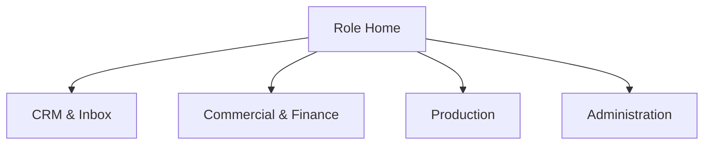
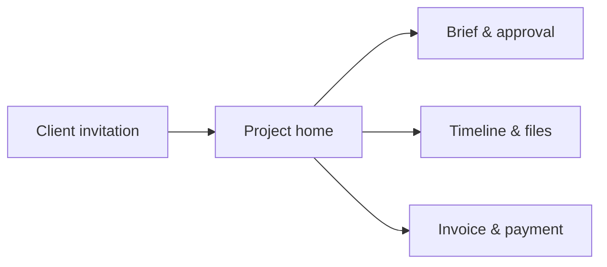

**DOKUMEN 03**

**UX/UI & Workflow Specification**

Information architecture, screen inventory, interaction states, forms, responsive behavior, dan accessibility

| **Metadata** | **Keterangan**                                                       |
|--------------|----------------------------------------------------------------------|
| Produk       | Multi-Brand CRM & Project Operations Platform                        |
| Organisasi   | Perusahaan Multi-Brand                                               |
| Audiens      | Product Designer, UX Researcher, Frontend, Product Owner, QA         |
| Versi        | 1.1 — mencakup corporate SSO `@udp.co.id` dan integrasi email        |
| Tanggal      | 29 Agustus 2026                                                      |
| Status       | Baseline untuk discovery, desain, pengembangan, QA, dan implementasi |

**CATATAN PENGGUNAAN**

Dokumen ini adalah baseline pembangunan. Nilai legal perusahaan, kebijakan pajak, daftar user, kredensial integrasi, serta detail paket layanan perlu dikonfirmasi pada discovery sebelum production release.

# Kontrol Dokumen

| **Item**         | **Nilai**                                                                                                   |
|------------------|-------------------------------------------------------------------------------------------------------------|
| Pemilik dokumen  | Product Owner / Direktur yang ditunjuk                                                                      |
| Cakupan          | Pengalaman internal app dan client portal; user flow, screen contracts, components, content, dan acceptance |
| Siklus review    | Setiap akhir fase discovery dan sebelum release mayor                                                       |
| Sumber kebenaran | Repository dokumentasi proyek dan keputusan arsitektur                                                      |
| Perubahan        | Melalui change request dengan pemilik, alasan, dampak, dan approval                                         |

## Cara Membaca Paket Ini

- Dokumen 01 menjelaskan apa yang dibangun dan aturan bisnisnya.

- Dokumen 02 menjelaskan bagaimana sistem dibangun, disimpan, diamankan, dan diintegrasikan.

- Dokumen 03 menjelaskan pengalaman pengguna, navigasi, layar, state, dan pola interaksi.

- Dokumen 04 menjelaskan urutan delivery, backlog, pengujian, peluncuran, dan operasional.

# 1. Experience Strategy

Aplikasi harus terasa seperti satu workspace operasional, bukan kumpulan modul terputus. Detail record menjadi pusat kerja: percakapan, next action, brief, nilai, file, approval, dan history terlihat dalam konteks yang sama dengan permission yang tepat.

| **Prinsip**             | **Penerapan**                                                                     |
|-------------------------|-----------------------------------------------------------------------------------|
| Next action first       | Setiap lead/project memperlihatkan owner, status, due date, dan action berikutnya |
| Context over navigation | Side panel/detail tabs tanpa kehilangan posisi list/inbox                         |
| Explain automation      | Tampilkan mengapa reminder/score/merge suggestion terjadi                         |
| Progressive disclosure  | Field sensitif/lanjutan hanya muncul saat relevan dan berizin                     |
| No silent change        | Stage, assignment, merge, quote issue, approval selalu memberi feedback/history   |
| Client-safe by design   | Visibility state eksplisit; internal note tidak mudah salah kirim                 |
| Global-ready            | Timezone, bahasa, nomor, mata uang, dan business hours kontekstual                |

# 2. Information Architecture

*Gambar 1. Kelompok navigasi utama; item aktual mengikuti permission role.*

## 2.1 Login dan Pemilihan Akses Staf

1. User membuka internal app dan memilih **Masuk dengan Email UDP**.
2. User diarahkan ke identity provider perusahaan; form aplikasi tidak meminta atau menyimpan password email.
3. Setelah callback berhasil, sistem memvalidasi tenant, email terverifikasi `@udp.co.id`, status user, role, dan brand scope.
4. Bila akses baru belum disetujui, tampilkan halaman **Akses menunggu aktivasi** tanpa mengekspos data organisasi.
5. Bila user memiliki beberapa brand, sistem membuka brand terakhir yang sah dan menyediakan brand switcher.
6. Bila akun disabled atau tidak memiliki membership, tampilkan akses ditolak dengan correlation ID dan kanal bantuan internal.

Client portal harus menggunakan CTA dan session terpisah agar client tidak diarahkan ke login staf UDP.

| **Navigation group** | **Screens**                                                           |
|----------------------|-----------------------------------------------------------------------|
| Command Center       | Role dashboard, notifications, my tasks, approvals                    |
| Lead Inbox           | Unified inbox, unassigned, SLA breached, duplicates, imports          |
| CRM                  | Contacts, companies, conversations, activities                        |
| Sales                | Opportunities kanban/table, sequences, templates, meetings, proposals |
| Commercial           | Estimates, budgets, quotes, approvals                                 |
| Finance              | Invoices, payments, receivables, expenses, profitability              |
| Projects             | Handover, projects, timeline, resources, files, revisions, risks      |
| Reports              | Funnel, forecast, channel, team, delivery, finance                    |
| Admin                | Brands, services, pipelines, users, roles, integrations, audit        |

# 3. Application Shell

| **Area**        | **Desktop**                                                   | **Mobile/responsive**                     |
|-----------------|---------------------------------------------------------------|-------------------------------------------|
| Top bar         | Brand switcher, global search, create, notifications, profile | Compact brand/search/action               |
| Side nav        | Collapsible groups dan badges                                 | Drawer; preserve current context          |
| Content header  | Title, context, status, owner, primary action                 | Stacked; primary action sticky bila perlu |
| Workspace       | List + detail split pane untuk inbox/CRM                      | List -\> full screen detail               |
| Right rail      | Next action, activity, related records                        | Collapsible sections                      |
| Command palette | Search/create/navigation                                      | Optional; keyboard focus desktop          |

## 3.1 Global Search

- Mencari contact, company, opportunity, project, quote, invoice sesuai permission.

- Hasil dikelompokkan berdasarkan entity, menampilkan brand/context, dan mendukung keyboard navigation.

- Nomor/email yang cocok menunjukkan normalized value tanpa menampilkan data di luar izin.

- Pencarian tidak mengungkap keberadaan client/project yang tidak berhak dilihat.

# 4. Role-based Home

| **Role**    | **Above the fold**                                            | **Primary actions**                            |
|-------------|---------------------------------------------------------------|------------------------------------------------|
| Super Admin | Integration health, user/security alerts, config changes      | Add brand/user, resolve failure, inspect audit |
| Direktur    | Forecast, revenue, funnel, lost, project risk, receivable     | Comment, set target, approve, open drill-down  |
| Marketing   | New inbox, overdue follow-up, today's meetings, pipeline      | Claim lead, reply, update stage, schedule      |
| Finance     | Estimate/approval queue, due/overdue invoices, reconciliation | Build budget, issue invoice, verify payment    |
| Production  | New handover, milestones, workload, blockers, revisions       | Plan project, assign, update, upload           |
| Client      | Project status, action needed, latest files, invoices         | Approve, comment, upload input, pay/confirm    |

# 5. Unified Lead Inbox

## 5.1 Layout

| **Pane**      | **Content**                                                                               |
|---------------|-------------------------------------------------------------------------------------------|
| Left/list     | Sender, company, channel icon, brand, preview, received time, SLA, unread, duplicate flag |
| Center/thread | Chronological messages, channel separators, attachments, reply composer, delivery state   |
| Right/context | Contact/company match, source, opportunity, owner, tags, score, next action               |

## 5.2 Triage Actions

- Claim/assign, mark spam/invalid, link to contact, create contact, create/link opportunity, merge review, reply, schedule task.

- Keyboard shortcuts untuk next/previous, assign to me, reply, create opportunity, snooze jika accessibility tetap terjaga.

- SLA badge menggunakan label teks selain warna: On time, Due soon, Breached.

- Jika dua marketer membuka item yang sama, tampilkan presence/claim state dan optimistic conflict feedback.

| **CRITICAL UX** Composer harus selalu menunjukkan sender brand, nomor/email pengirim, penerima, dan visibility. User tidak boleh mengirim dari brand yang salah tanpa peringatan. |
|-----------------------------------------------------------------------------------------------------------------------------------------------------------------------------------|

# 6. Contacts dan Companies

| **Screen**     | **Key sections**                                                         | **Primary action**         |
|----------------|--------------------------------------------------------------------------|----------------------------|
| Contact list   | Identity, company, brands engaged, owner, last interaction, tags         | Create/import/export       |
| Contact detail | Overview, identities, opportunities, timeline, notes, consent            | Message/create opportunity |
| Company list   | Industry, country, contacts, open pipeline, projects, lifetime value     | Create/merge               |
| Company detail | Contacts, opportunities, projects, finance summary, files                | Add contact/opportunity    |
| Merge review   | Side-by-side fields, conflicts, relationship counts, destination preview | Merge/keep separate        |

## 6.1 Contact Form Sections

- Identity: full name, preferred name, job title, language, timezone.

- Channels: email(s), WhatsApp, phone(s), website/social identities, verification and preference.

- Company: existing company lookup atau create inline; role in buying process.

- Location: country required when international context matters; address optional/minimized.

- Consent/preferences: allowed channels, unsubscribe, source, recorded_at.

- Internal: owner, tags, notes; visibility label.

# 7. Opportunity Workspace

| **Header**                                                             | **Tabs**                                                     | **Right rail**                                     |
|------------------------------------------------------------------------|--------------------------------------------------------------|----------------------------------------------------|
| Name, company/contact, brand/service, stage, value, probability, owner | Overview, Timeline, Brief, Commercial, Tasks, Files, Related | Next action, score, SLA, health, director comments |

## 7.1 Kanban

- Column per brand pipeline stage; canonical stage mapping untuk combined view.

- Card: company/contact, service, amount/currency, probability, last touch, next action, owner, temperature, warning.

- Drag memberi stage preview dan meminta required fields bila exit criteria belum lengkap.

- Optimistic update boleh dilakukan tetapi rollback dengan pesan jelas jika server menolak.

- Column total menampilkan raw dan weighted value; user dapat menyembunyikan value sesuai permission.

## 7.2 Table

- Server-side sorting/filtering, saved views, custom columns, bulk assign/tag/task terbatas.

- Filter: brand, service, source, country, stage, owner, score, value, close date, last interaction, overdue.

- Bulk transition tidak tersedia untuk stage yang memerlukan unique field/approval kecuali controlled wizard.

- Export menampilkan row count, included fields, permission warning, dan audit notice sebelum dijalankan.

# 8. Timeline dan Conversation UX

| **Interaction type** | **Visual treatment**                    | **Actions**                      |
|----------------------|-----------------------------------------|----------------------------------|
| Inbound message      | Left/neutral card + channel + timestamp | Reply, link, task, quote snippet |
| Outbound message     | Right/accent + sender + delivery/read   | Retry if failed, copy link       |
| Call                 | Compact event with duration/outcome     | Add note/follow-up               |
| Meeting              | Event card with attendees/summary       | Open minutes/create tasks        |
| Internal note        | Tinted, clearly INTERNAL                | Edit history, mention            |
| Stage/system event   | Compact audit marker                    | Expand details                   |
| Client comment       | Client identity + visibility badge      | Reply/resolve                    |

- Timeline default newest-last untuk conversation dan newest-first untuk activity feed, namun konsisten per screen.

- Channel switch tidak memutus chronological history; filter dapat memilih All/WhatsApp/Email/Instagram/Calls/Notes.

- Internal note composer berbeda warna dan label dari message composer.

- Email reply memperlihatkan subject/thread recipients; WhatsApp memperlihatkan template/session constraint bila provider menyediakannya.

# 9. Follow-up Builder

| **Step editor field** | **Behavior**                                                      |
|-----------------------|-------------------------------------------------------------------|
| Trigger               | Stage/source/service/tag/manual enrollment                        |
| Delay                 | Duration + business hours + timezone policy                       |
| Channel               | WhatsApp/email/task/call reminder                                 |
| Template              | Approved version; language fallback; preview with sample data     |
| Execution             | Create draft, require approval, or auto-send if enabled           |
| Stop condition        | Reply, stage change, meeting, opt-out, manual, invalid/lost       |
| Fallback              | If channel unavailable, create task or alternate approved channel |

## 9.1 Template Editor

- Plain/rich text sesuai kanal, variable insertion menu, validation, live preview mobile/email.

- Test render dengan sample contact; missing variable tidak boleh menghasilkan pesan rusak.

- Version notes dan compare; draft -\> review -\> approved -\> retired.

- Analytics ditautkan ke template version, bukan hanya template name.

# 10. Brief, Estimate, dan Quote UX

## 10.1 Brief Builder

| **Section**        | **Contoh field**                                         |
|--------------------|----------------------------------------------------------|
| Business context   | Background, problem, objective, audience, success metric |
| Deliverables       | Type, quantity, duration/size, format, platform          |
| Creative/technical | Style, reference, technology, integrations, constraints  |
| Schedule           | Target date, fixed event, review windows, dependencies   |
| Assets             | Brand guide, content, data, access, legal clearance      |
| Stakeholders       | Decision maker, approver, day-to-day contact             |
| Commercial         | Budget signal, procurement, tax/currency, payment term   |

## 10.2 Collaborative Estimation

- Marketing mengisi client context dan desired range; Production menambah resource/assumption; Finance menyusun cost/pricing.

- Status chip: Draft, Waiting Production, Waiting Finance, Waiting Approval, Approved, Superseded.

- Comment ditempel ke line/section; mention dan resolution tercatat.

- Margin panel hanya terlihat sesuai permission; warning saat threshold dilanggar.

## 10.3 Quote Preview

- Preview mengikuti branding dan legal entity; version/validity jelas.

- Scope, exclusions, assumptions, timeline, payment term, tax, currency, acceptance method.

- Issue action meminta confirmation karena version menjadi immutable.

- Status delivery: generated, sent, viewed bila tersedia, accepted, rejected, expired, superseded.

# 11. Finance Workspace

| **Screen**     | **Key UX**                                                                 |
|----------------|----------------------------------------------------------------------------|
| Approval queue | Reason, threshold, compare version, comment, approve/reject/request change |
| Invoices       | Status, company/project, currency, issue/due, total, outstanding, aging    |
| Invoice detail | Document preview, payment allocations, reminders, history                  |
| Payments       | Reference, proof preview, verification, allocations, unmatched             |
| Receivables    | Aging groups, dispute/reminder state, owner, next action                   |
| Profitability  | Revenue vs budget/actual cost, variance, field-level restriction           |

| **FINANCIAL INTEGRITY** Issued invoice edit bukan inline form biasa. UI harus mengarahkan user ke revision, void, atau credit-note flow sesuai kebijakan Finance. |
|-------------------------------------------------------------------------------------------------------------------------------------------------------------------|

# 12. Production Workspace

| **View**           | **Purpose**                                     | **Key interactions**                     |
|--------------------|-------------------------------------------------|------------------------------------------|
| Handover queue     | Validasi deal siap diproduksi                   | Accept/request info/assign PM/template   |
| Project overview   | Health, scope, budget, contacts, next milestone | Update status/risk/client update         |
| Timeline/Gantt     | Phase/milestone/dependency                      | Drag date dengan impact preview          |
| Board/list         | Task execution                                  | Assign, status, due, dependency, comment |
| Workload           | Capacity tim/resource                           | Reassign, spot over-allocation           |
| Files/deliverables | Version dan approval                            | Upload, preview, mark client-visible     |
| Revision           | Request dan included rounds                     | Triage, estimate impact, resolve         |
| Risk/change        | Controlled deviation                            | Assess, approve, communicate             |

# 13. Client Portal UX

*Gambar 2. Portal berfokus pada action yang dibutuhkan client, bukan kompleksitas internal.*

| **Page**         | **Content**                                   | **Primary CTA**               |
|------------------|-----------------------------------------------|-------------------------------|
| Home             | All authorized projects dan action needed     | Open project                  |
| Project overview | Progress, next milestone, team, latest update | Complete required action      |
| Timeline         | Milestones dan client dependencies            | Open milestone                |
| Deliverable      | Preview/version/notes                         | Approve atau request revision |
| Files            | Approved/shared files                         | View/download/upload input    |
| Commercial       | Quote, contract, invoice, payment             | Accept/download/pay/confirm   |
| Settings         | Profile, language, timezone, notification     | Save                          |

## 13.1 Client Approval Flow

- Tampilkan nama deliverable, version, preview, due date, included revision balance, dan impact notice.

- Approve memerlukan confirmation; Request revision memerlukan categorized note dan optional annotation/file.

- Jika version berubah saat page terbuka, block action dan minta reload.

- Confirmation menghasilkan receipt yang dapat dilihat client dan internal team.

# 14. Form and Validation Standards

| **Field**       | **Rule**                                                         |
|-----------------|------------------------------------------------------------------|
| Name            | Support international characters; trim; do not over-validate     |
| Email           | Syntax + normalization; verification separate                    |
| Phone/WhatsApp  | Country picker, E.164 normalized, raw display preserved          |
| Currency amount | Currency explicit, locale formatting, exact decimals/minor units |
| Date/time       | Show timezone; business-hour awareness; no ambiguous format      |
| Website/domain  | Normalize scheme/domain; allow internationalized domains         |
| Required field  | Label + inline message + summary on submit; not color-only       |
| Sensitive field | Permission hint; masked by default when appropriate              |
| Long brief      | Autosave draft, last saved indicator, conflict handling          |

- Validate on blur untuk format ringan; validate on submit untuk business rule; jangan mengganggu saat typing.

- Server errors dipetakan ke field dan correlation ID; value user tidak hilang.

- Destructive action menggunakan target name dan dampak, bukan confirmation generik.

# 15. Component Inventory

| **Component**    | **Contract**                                         |
|------------------|------------------------------------------------------|
| BrandSwitcher    | Current brand, All brands option, permission-aware   |
| EntityLink       | Icon, label, secondary context, safe navigation      |
| StatusBadge      | Color + text + semantic token                        |
| Money            | Currency, locale, permission redaction               |
| TimeAgo/DateTime | Relative + exact tooltip + timezone                  |
| OwnerPicker      | Brand/team scoped, unassigned state                  |
| StageSelector    | Exit criteria preview and transition reason          |
| ActivityTimeline | Filter, grouping, pagination, visibility             |
| MessageComposer  | Sender/channel/template/attachments/consent          |
| NextAction       | Owner, due, type, status/outcome                     |
| FilterBuilder    | Typed operators, saved views, reset/share            |
| DataTable        | Server sort/filter, columns, selection, bulk actions |
| KanbanBoard      | Virtualization, totals, drag validation              |
| ApprovalPanel    | Resource version, diff, decision, comment            |
| FileUploader     | Large/resumable, scan, visibility, version           |
| AuditDrawer      | Who/when/before-after/source                         |
| PermissionGate   | UX only; server still authoritative                  |
| EmptyState       | Why empty + next safe action                         |

# 16. Design Tokens

| **Token group** | **Baseline**                                                                   |
|-----------------|--------------------------------------------------------------------------------|
| Typography      | Readable sans; 14-16px body web; 1.4-1.6 line-height; clear hierarchy          |
| Color           | Neutral surfaces; brand accent as context; semantic success/warning/error/info |
| Spacing         | 4px base grid; 8/12/16/24/32 primary scale                                     |
| Radius          | 6-10px controls/cards; avoid excessive pill shapes                             |
| Elevation       | Minimal; use border/surface first; modal/popover only                          |
| Motion          | 150-250ms; respect reduced motion; no essential info only in animation         |
| Density         | Comfortable default, compact table option for desktop power users              |

| **MULTI-BRAND VISUAL RULE** Brand color memberi konteks pada switcher, portal, document, dan selective accent. Semantic status color tetap konsisten agar Won/Lost/Overdue tidak berubah makna antar-brand. |
|-------------------------------------------------------------------------------------------------------------------------------------------------------------------------------------------------------------|

# 17. States: Loading, Empty, Error, Offline

| **State**            | **Pattern**                                                              |
|----------------------|--------------------------------------------------------------------------|
| Loading              | Skeleton mengikuti final layout; retain filters; avoid full-page spinner |
| Empty first use      | Explain purpose + primary setup action                                   |
| Empty filtered       | Show active filters + clear filter                                       |
| Permission denied    | No data hints; explain access path/contact admin                         |
| Not found            | Could be deleted/moved/no access; safe navigation                        |
| Validation error     | Inline + summary; focus first error                                      |
| Provider outage      | Banner, queued/draft status, retry expectation                           |
| Offline/intermittent | Preserve draft; show sync state; prevent duplicate send                  |
| Conflict             | Compare current vs attempted version; reload/reapply                     |

# 18. Accessibility dan Localization

- WCAG 2.2 AA target untuk core workflows; semantic heading/landmarks/form labels.

- Semua action dapat dilakukan keyboard; focus order dan focus return setelah modal konsisten.

- Status tidak mengandalkan warna; icon memiliki accessible name; chart memiliki table/summary alternative.

- Touch target cukup; zoom 200% tidak memotong action; reflow portal pada mobile.

- Copy tersedia Bahasa Indonesia dan Inggris; content template memiliki version per language.

- Format locale untuk tanggal, waktu, nomor, currency; timestamp selalu dapat memperlihatkan timezone.

- Nama, perusahaan, dan alamat mendukung Unicode; hindari asumsi first/last name wajib.

# 19. Notification Strategy

| **Priority**    | **Examples**                                        | **Channels**                    |
|-----------------|-----------------------------------------------------|---------------------------------|
| Critical        | Security event, payment mismatch, failed issue/send | In-app + email; escalation      |
| Action required | Approval, client input, handover incomplete         | In-app + preference email       |
| Time-sensitive  | SLA breach, overdue follow-up/milestone/invoice     | In-app + configurable           |
| Informational   | Stage change, comment, file uploaded                | In-app digest/direct preference |

- Notification berisi resource, reason, expected action, due time, dan deep link.

- Deduplicate burst events; support mark read, archive, and preference per category.

- Client notification tidak pernah membawa internal note, cost, atau sensitive identifier.

# 20. Screen Acceptance Checklist

| **Area**      | **Acceptance**                                                        |
|---------------|-----------------------------------------------------------------------|
| Authorization | Screen, action, API, file link diuji untuk role/brand/company berbeda |
| Happy path    | Primary task selesai tanpa jalan memutar                              |
| Required data | Field dan exit criteria jelas sebelum action                          |
| States        | Loading, empty, error, offline, conflict, disabled terdokumentasi     |
| Audit         | Critical action memberi confirmation/history                          |
| Responsive    | Desktop dan target mobile widths diperiksa                            |
| Accessibility | Keyboard, focus, label, contrast, screen reader basics                |
| Localization  | ID/EN expansion, long names, currency/date/timezone                   |
| Performance   | Pagination/virtualization untuk list besar; no blocking media         |
| Telemetry     | Event names, success/failure, no sensitive payload                    |

# 21. UX Research dan Validation Plan

| **Round**   | **Participants**                                       | **Tasks**                                   | **Success signal**                     |
|-------------|--------------------------------------------------------|---------------------------------------------|----------------------------------------|
| Discovery   | 2 Direktur/Admin, 3 Marketing, 2 Finance, 3 Production | Current process, artifacts, exceptions      | Workflow/risk map validated            |
| Prototype 1 | Marketing + Director                                   | Triage, merge, qualify, lost/nurture        | Task completion, low confusion         |
| Prototype 2 | Finance + Production                                   | Estimate, quote, handover, change request   | No context loss; permissions clear     |
| Portal      | 3-5 representative clients                             | Review progress, approve, revision, invoice | Trust, comprehension, mobile usability |
| UAT         | Role champions                                         | End-to-end realistic scenarios              | Acceptance criteria passed             |
