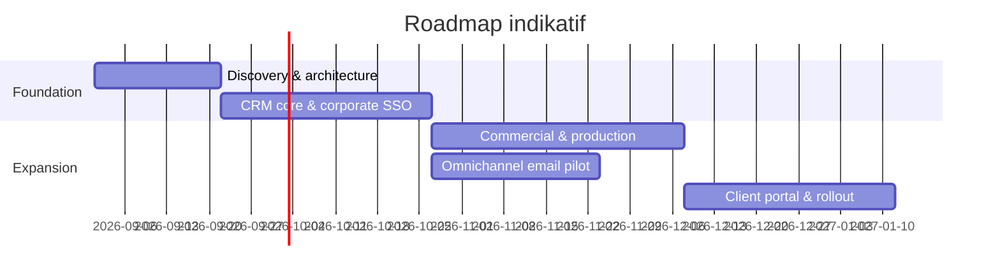

**DOKUMEN 04**

**Delivery Roadmap, QA & Operations Plan**

Roadmap, backlog, team, test strategy, migration, launch, support, risk, dan governance

| **Metadata** | **Keterangan**                                                              |
|--------------|-----------------------------------------------------------------------------|
| Produk       | Multi-Brand CRM & Project Operations Platform                               |
| Organisasi   | Perusahaan Multi-Brand                                                      |
| Audiens      | Sponsor/Direktur, Product Owner, Engineering, QA, DevOps, Change Management |
| Versi        | 1.1 — mencakup corporate SSO `@udp.co.id` dan integrasi email           |
| Tanggal      | 29 Agustus 2026                                                             |
| Status       | Baseline untuk discovery, desain, pengembangan, QA, dan implementasi        |

**CATATAN PENGGUNAAN**

Dokumen ini adalah baseline pembangunan. Nilai legal perusahaan, kebijakan pajak, daftar user, kredensial integrasi, serta detail paket layanan perlu dikonfirmasi pada discovery sebelum production release.

# Kontrol Dokumen

| **Item**         | **Nilai**                                                                                          |
|------------------|----------------------------------------------------------------------------------------------------|
| Pemilik dokumen  | Product Owner / Direktur yang ditunjuk                                                             |
| Cakupan          | Rencana delivery bertahap dari discovery sampai operasional; estimasi divalidasi setelah discovery |
| Siklus review    | Setiap akhir fase discovery dan sebelum release mayor                                              |
| Sumber kebenaran | Repository dokumentasi proyek dan keputusan arsitektur                                             |
| Perubahan        | Melalui change request dengan pemilik, alasan, dampak, dan approval                                |

## Cara Membaca Paket Ini

- Dokumen 01 menjelaskan apa yang dibangun dan aturan bisnisnya.

- Dokumen 02 menjelaskan bagaimana sistem dibangun, disimpan, diamankan, dan diintegrasikan.

- Dokumen 03 menjelaskan pengalaman pengguna, navigasi, layar, state, dan pola interaksi.

- Dokumen 04 menjelaskan urutan delivery, backlog, pengujian, peluncuran, dan operasional.

# 1. Delivery Strategy

Program harus memberikan nilai lebih awal melalui CRM core, kemudian memperluas ke commercial/production dan omnichannel. Integrasi channel tidak dimulai sebelum identity model, audit, idempotency, dan permission stabil karena volume pesan dapat memperbesar kesalahan data dengan cepat.

*Gambar 1. Roadmap indikatif; durasi final bergantung discovery, data migrasi, provider, dan ukuran tim.*

| **PLANNING RULE** Estimasi dalam dokumen adalah range untuk capacity planning, bukan komitmen kontraktual. Setelah Sprint 0, tim membuat release plan berbasis backlog yang sudah di-estimate. |
|------------------------------------------------------------------------------------------------------------------------------------------------------------------------------------------------|

# 2. Phase Plan dan Exit Criteria

| **Phase**                 | **Range**  | **Deliverables**                                                                     | **Exit criteria**                                               |
|---------------------------|------------|--------------------------------------------------------------------------------------|-----------------------------------------------------------------|
| 0\. Discovery/Foundation  | 2 minggu   | Process/data map, decisions, prototype, architecture, environments                   | Critical open decisions owned; backlog ready; security baseline |
| 1\. CRM Core              | 6-8 minggu | Multi-brand, IAM, inbox manual/form, contact/company, pipeline, timeline, task, lost | Marketing pilot can run one brand end-to-end                    |
| 2\. Commercial/Production | 6-8 minggu | Estimate, budget, quote, invoice/payment, project, milestone, file, portal           | Won-to-delivery and client approval tested                      |
| 3\. Omnichannel           | 4-6 minggu | WhatsApp, email, Instagram adapters, sequences, health/reconciliation                | Channel pilot stable; duplicate/double-send controls passed     |
| 4\. Optimization          | Ongoing    | Forecast, advanced analytics, automation, AI assist                                  | Evidence-based KPI improvement                                  |

# 3. Team Topology

| **Role**             | **Suggested capacity** | **Primary accountability**                             |
|----------------------|------------------------|--------------------------------------------------------|
| Executive Sponsor    | 0.1-0.2                | Priority, budget, escalation, policy decisions         |
| Product Owner/BA     | 1                      | Backlog, process, acceptance, stakeholder alignment    |
| Product Designer     | 0.5-1                  | Research, flows, design system, validation             |
| Tech Lead            | 1                      | Architecture, standards, review, delivery risk         |
| Full-stack Engineers | 2-4                    | Modules, API, UI, tests                                |
| QA Engineer          | 1                      | Test strategy, automation, UAT support                 |
| DevOps/SRE           | 0.25-0.5               | CI/CD, environments, observability, recovery           |
| Security/Privacy     | Part-time gates        | Threat model, review, incident readiness               |
| Role Champions       | Part-time              | Marketing/Finance/Production pilot and change adoption |

Kapasitas adalah full-time equivalent indikatif. Tim kecil dapat menggabungkan role, tetapi Product Ownership, security review, dan independent QA tidak boleh hilang.

# 4. Governance dan RACI

| **Decision/Activity** | **Sponsor** | **PO** | **Tech** | **Ops roles** | **QA/Sec** |
|-----------------------|-------------|--------|----------|---------------|------------|
| Scope/prioritas       | A           | R      | C        | C             | I          |
| Business rule         | A           | R      | C        | R/C           | C          |
| Architecture          | I           | C      | A/R      | C             | C          |
| Security/privacy      | A           | C      | R        | C             | R          |
| Acceptance/UAT        | I           | A      | C        | R             | R          |
| Production release    | A           | R      | R        | C             | C          |
| Incident              | I/A major   | C      | R        | C             | R          |

R = Responsible, A = Accountable, C = Consulted, I = Informed.

# 5. Epic Backlog

| **ID** | **Epic**                    | **Priority** | **Outcome**                                              |
|--------|-----------------------------|--------------|----------------------------------------------------------|
| E01    | Organization & Brand Config | P0           | Create brand/service/pipeline/SLA/numbering without code |
| E02    | Identity & Access           | P0           | Role/brand/field/client access and MFA-ready auth        |
| E03    | Lead Inbox                  | P0           | Capture, triage, assignment, SLA, source                 |
| E04    | Contact/Company             | P0           | Global identity, duplicates, merge, consent              |
| E05    | Opportunity/Pipeline        | P0           | Kanban/table, stages, score, forecast, lost/nurture      |
| E06    | Interactions                | P0           | Unified timeline, manual activity, files, internal notes |
| E07    | Tasks/Follow-up             | P0           | Next action, reminders, outcomes; sequence P1            |
| E08    | Commercial                  | P0           | Estimate, budget, quote, approval, contract              |
| E09    | Finance                     | P0           | Invoice, payment, allocation, receivable                 |
| E10    | Project/Handover            | P0           | Project templates, milestones, task, risk                |
| E11    | Files/Revision              | P0           | Version, visibility, approval, change request            |
| E12    | Client Portal               | P0           | Invitations, project, approvals, files, invoice          |
| E13    | Reports                     | P0           | Role dashboards and metric definitions                   |
| E14    | Integrations                | P1           | Website, WhatsApp, email, Instagram adapters             |
| E15    | Automation                  | P1           | Sequences, templates, scheduler, stop rules              |
| E16    | Audit/Security              | P0           | Audit, exports, events, monitoring, recovery             |
| E17    | Migration/Admin             | P0           | Imports, mapping, validation, reconciliation             |
| E18    | Analytics/AI Assist         | P2           | Summaries, recommendations, advanced forecast            |

# 6. Sprint-Level Indicative Plan

| **Iteration** | **Primary scope**                                                                                 |
|---------------|---------------------------------------------------------------------------------------------------|
| Sprint 0      | Discovery, process map, data samples, permission workshop, clickable prototype, ADR, environments |
| Sprint 1      | Auth, organization/brand, user membership, audit skeleton, app shell                              |
| Sprint 1A     | Corporate SSO `@udp.co.id`, tenant validation, invitation/JIT, session revoke, privileged MFA test |
| Sprint 2      | Contact/company/identity, lead source, manual intake, basic search                                |
| Sprint 3      | Inbox/form webhook, assignment/SLA, opportunity pipeline, stage history                           |
| Sprint 4      | Timeline, tasks, lost/nurture, dashboard pilot; Phase 1 UAT                                       |
| Sprint 5      | Brief/estimate/budget collaboration, approval framework                                           |
| Sprint 6      | Quote/version/PDF/delivery, invoice/payment baseline                                              |
| Sprint 7      | Handover/project templates, milestones/tasks/resources                                            |
| Sprint 8      | Files/revisions/change requests, client portal access/overview                                    |
| Sprint 9      | Client approvals/commercial portal, finance/project dashboards; Phase 2 UAT                       |
| Sprint 10+    | Channel adapters one by one, sequence automation, reconciliation, hardening                       |

Asumsi sprint dua minggu. Split/sequence diubah setelah estimation dan dependency mapping.

# 7. User Story Samples

| **ID**       | **Story**                                                                                              | **Acceptance anchors**                                 |
|--------------|--------------------------------------------------------------------------------------------------------|--------------------------------------------------------|
| US-LEAD-01   | Sebagai Marketing, saya ingin melihat lead baru dari brand saya agar dapat merespons dalam SLA.        | Inbox scoped; source/time/SLA; claim; audit            |
| US-ID-02     | Sebagai Marketing, saya ingin menautkan email dan WhatsApp orang yang sama agar percakapan utuh.       | Candidate explainable; manual review; no conflict leak |
| US-AUTH-01   | Sebagai staf, saya ingin login dengan akun `@udp.co.id` agar tidak memiliki password CRM terpisah.      | OIDC valid; tenant/domain/status diverifikasi; audit tersedia |
| US-EMAIL-01  | Sebagai Marketing, saya ingin membalas email dari timeline lead agar seluruh tim melihat konteksnya.    | Sender brand benar; thread terjaga; outbound dan status tercatat |
| US-DIR-01    | Sebagai Direktur, saya ingin drill-down forecast agar dapat memberi arahan pada deal berisiko.         | Metric definition; filters; source records; comments   |
| US-LOST-01   | Sebagai Marketing, saya ingin mencatat alasan lost dan tanggal re-offer agar peluang tidak terlupakan. | Reason/note required; eligibility; task/sequence       |
| US-FIN-01    | Sebagai Finance, saya ingin menghitung budget dan margin sebelum quote diterbitkan.                    | Versioned lines; permissions; threshold approval       |
| US-PROD-01   | Sebagai Production, saya ingin menerima brief dan scope lengkap saat handover.                         | Gate; source versions; accept/request info             |
| US-CLIENT-01 | Sebagai Client, saya ingin melihat milestone dan menyetujui deliverable versi tertentu.                | Scoped portal; version; receipt; audit                 |
| US-ADMIN-01  | Sebagai Super Admin, saya ingin menambah brand tanpa code change.                                      | Config + services + access + templates                 |

# 8. Discovery Workplan

| **Workshop**     | **Participants**                | **Outputs**                                       |
|------------------|---------------------------------|---------------------------------------------------|
| Business goals   | Director, PO, team leads        | Success metrics, scope, constraints               |
| Lead journey     | Marketing, Director             | Sources, stages, exceptions, SLA, lost/nurture    |
| Finance          | Finance, Director, Marketing    | Pricing, tax, approval, invoice/payment rules     |
| Production       | Production leads, PM            | Service templates, capacity, file/revision/change |
| Client portal    | PM, Marketing, selected clients | Visibility, approval, notification                |
| Data/integration | IT/Admin, channel owners        | Systems, providers, credentials, volume, samples  |
| Security/privacy | Sponsor, IT, Finance            | Roles, retention, incident, export                |

## 8.1 Required Inputs

- Sample lead spreadsheets/export, email threads, WhatsApp workflows, forms, and source naming.

- Current quotation, invoice, payment term, budget sheets, tax/numbering rules.

- Service catalog, packages, production checklists, timeline templates, revision policy.

- User list, role/brand mapping, approval thresholds, holiday/business hours.

- Historical volumes: contacts, leads/month, messages/day, projects, file sizes, currencies/countries.

# 9. Data Migration Plan

| **Stage**    | **Action**                                                    | **Control**              |
|--------------|---------------------------------------------------------------|--------------------------|
| Inventory    | List spreadsheets/tools/owners/date ranges                    | Source register          |
| Profile      | Nulls, formats, duplicates, invalid email/phone, currency     | Data quality report      |
| Map          | Source column -\> canonical field; brand/source/stage mapping | Signed mapping           |
| Clean        | Normalize, resolve obvious invalids, preserve raw             | Transformation log       |
| Dry run      | Import to staging with batch IDs                              | Counts, samples, rejects |
| Deduplicate  | Exact + candidate review; negative links                      | Merge report             |
| Reconcile    | Totals by source/brand/stage/value                            | Owner sign-off           |
| Cutover      | Freeze window/delta import/rollback                           | Runbook                  |
| Post-cutover | Monitor errors, missing records, adoption                     | Hypercare queue          |

| **MIGRATION RULE** Jangan menghapus atau menimpa source data. Setiap imported record membawa import_batch_id, source row reference, dan transformation result. |
|----------------------------------------------------------------------------------------------------------------------------------------------------------------|

# 10. Integration Rollout

| **Order** | **Integration**     | **Prerequisites**                                    | **Pilot exit**                         |
|-----------|---------------------|------------------------------------------------------|----------------------------------------|
| 1         | Brand website forms | Signed webhook, source/UTM mapping                   | No loss/duplicate; SLA working         |
| 2         | Shared email        | Thread/identity model, mailbox permission            | Reply/thread/bounce stable             |
| 3         | WhatsApp            | Provider/account, templates/consent, idempotent send | Inbound/outbound/status/retry stable   |
| 4         | Instagram           | Business account permissions and supported event map | Identity/context and limits understood |
| 5         | Other channels      | Adapter contract and business case                   | Per-provider acceptance                |

# 11. Test Strategy

| **Level**   | **Coverage**                                                       | **Owner**           |
|-------------|--------------------------------------------------------------------|---------------------|
| Unit        | Business rules, calculations, policies, parsers, state transitions | Engineers           |
| Component   | UI states, validation, accessibility behavior                      | Frontend + QA       |
| Integration | Database transactions, storage, queue, provider adapters           | Engineers + QA      |
| Contract    | Webhook/API schemas and provider sandbox responses                 | Backend             |
| E2E         | Role workflows from intake to delivery/payment                     | QA                  |
| Security    | Authz negative tests, injection, file, export, session             | QA + Security       |
| Performance | Inbox/timeline/search/report/file concurrency                      | QA + Tech           |
| Recovery    | Backup restore, queue replay, provider outage                      | DevOps + Tech       |
| UAT         | Realistic role scenarios and data                                  | Role Champions + PO |

# 12. Critical End-to-End Test Scenarios

| **ID** | **Scenario**                                                             |
|--------|--------------------------------------------------------------------------|
| E2E-01 | Website lead -\> assigned -\> qualified -\> proposal -\> won -\> project |
| E2E-02 | Email lead matched to existing WhatsApp contact without duplicate        |
| E2E-03 | Fuzzy duplicate remains separate until authorized merge                  |
| E2E-04 | Lost price -\> nurture -\> reactivated cross-sell opportunity            |
| E2E-05 | Discount below margin threshold blocked pending approval                 |
| E2E-06 | Issued quote superseded by new version; history remains                  |
| E2E-07 | Payment partially allocated across invoice term                          |
| E2E-08 | Won blocked due incomplete handover; exception audited                   |
| E2E-09 | Client approves exact deliverable version; newer version conflict        |
| E2E-10 | Client A attempts Client B URL/file and receives no data                 |
| E2E-11 | Provider retries webhook; one interaction created                        |
| E2E-12 | Outbound retry does not double-send                                      |
| E2E-13 | Opt-out stops pending sequence steps across channels                     |
| E2E-14 | Cross-brand user only sees authorized brands and fields                  |
| E2E-15 | Export follows fields/filter and creates security audit event            |
| E2E-16 | Restore backup and replay pending outbox without duplication             |

# 13. UAT Plan

- Gunakan role champions dan data staging yang realistis tetapi masked/synthetic.

- Setiap scenario memiliki precondition, steps, expected result, evidence, severity, owner.

- UAT blocker: data exposure, financial inconsistency, duplicate send, lost audit, core workflow failure.

- Product Owner menerima feature hanya setelah defect severity tinggi tertutup dan acceptance criteria terbukti.

- UAT sign-off per phase; unresolved minor items masuk release note dengan owner/date.

# 14. Performance and Capacity Test

| **Workload**  | **Test**                                                          |
|---------------|-------------------------------------------------------------------|
| Lead burst    | Concurrent website/channel webhook; queue age; idempotency        |
| Unified inbox | Large filtered list and unread counts; pagination                 |
| Timeline      | Thousands of interactions/attachments; cursor loading             |
| Kanban        | Hundreds/thousands opportunities; aggregation and drag transition |
| Reports       | Date/brand filters over realistic history; async export           |
| File          | Large upload/resume/download; preview generation; authorization   |
| Scheduler     | Many follow-up due same minute; stop rules and rate limits        |

Target numeric dikonfirmasi setelah volume data dan peak concurrency diukur saat discovery.

# 15. Security and Privacy Gates

| **Gate**       | **Required evidence**                                                             |
|----------------|-----------------------------------------------------------------------------------|
| Design         | Threat model, data classification, trust boundary, retention, provider assessment |
| Implementation | Code review, dependency/secret scan, authz tests, secure file flow                |
| Pre-UAT        | Privilege matrix test, client isolation, audit completeness, incident paths       |
| Pre-release    | No critical/high unresolved, backup restore evidence, access review               |
| Post-release   | Log/alert review, vulnerability patch cadence, periodic access recertification    |

# 16. Release Readiness Checklist

| **Category** | **Checklist**                                                             |
|--------------|---------------------------------------------------------------------------|
| Product      | Scope/acceptance complete; known issues documented; training ready        |
| Data         | Migration reconciliation signed; rejects owned; rollback source preserved |
| Security     | Roles reviewed; MFA/admin; secrets; audit; privacy notice/consent         |
| Technology   | CI/CD pass; migrations rehearsed; monitoring/alerts; capacity             |
| Operations   | Runbooks, support channel, ownership, escalation, provider contacts       |
| Recovery     | Backup recent; restore tested; rollback/feature flag                      |
| Business     | Brand/config/templates/SLA/numbering/tax approved                         |
| Client       | Portal copy, sender identities, invitations, help content                 |

# 17. Cutover Runbook

- T-14 sampai T-7: freeze schema decisions, dry-run migration, access review, training, comms.

- T-3: final rehearsal, backup verification, provider health, go/no-go review.

- T-0: maintenance/freeze if needed, final delta import, reconciliation, smoke tests, enable pilot users.

- T+1 hari: monitor errors, queue, SLA, data counts, user feedback; daily triage.

- T+7 hari: adoption/quality review; expand brand/users if pilot exit met.

- Rollback trigger: client data exposure, unreconciled financial corruption, uncontrolled duplicate send, unrecoverable core workflow failure.

# 18. Training and Change Management

| **Audience**       | **Training**                                                      |
|--------------------|-------------------------------------------------------------------|
| Super Admin        | Brand/user/permission/integration/audit/recovery basics           |
| Director           | Dashboard definitions, forecast, approvals, comments, planning    |
| Marketing          | Inbox, identity, qualification, pipeline, follow-up, lost/nurture |
| Finance            | Estimate/budget, quote/invoice/payment, approval, reconciliation  |
| Production         | Handover, project template, task/milestone, files/revision/change |
| Client-facing team | Portal invitation, visibility, approval support                   |

- Gunakan sandbox scenario per role, quick reference, short videos, office hours, dan named champions.

- Adoption metric: active users, lead capture completeness, next-action coverage, duplicate rate, overdue rate, portal engagement.

- Hindari paralel spreadsheet tanpa expiry; jika diperlukan, tetapkan read-only/source-of-truth rule.

# 19. Support and Operational SLA

| **Severity** | **Example**                                                                 | **Response target placeholder** | **Owner**           |
|--------------|-----------------------------------------------------------------------------|---------------------------------|---------------------|
| SEV-1        | Data exposure, financial corruption, uncontrolled double send, total outage | Immediate/on-call policy        | Incident Commander  |
| SEV-2        | Core role blocked, provider integration down without workaround             | Business-hours rapid response   | Tech Lead           |
| SEV-3        | Feature degraded, workaround available                                      | Planned within agreed SLA       | Product/Engineering |
| SEV-4        | Cosmetic/how-to/enhancement                                                 | Backlog/support cadence         | Product/Support     |

Nilai response/resolution target final harus disetujui sesuai jam kerja, zona waktu, dan kontrak internal/provider.

# 20. Operational SOPs

| **SOP**             | **Minimum steps**                                                                         |
|---------------------|-------------------------------------------------------------------------------------------|
| Unmatched inbound   | Review identity/source -\> link/create -\> assign -\> audit                               |
| Duplicate merge     | Preview -\> conflicts -\> select destination -\> approve -\> merge -\> verify/undo window |
| Provider outage     | Detect -\> disable risky send -\> communicate -\> queue/reconcile -\> resume gradually    |
| Failed message      | Check provider status -\> reconcile -\> safe retry/manual task -\> record outcome         |
| Payment mismatch    | Hold allocation -\> verify proof/reference -\> resolve/approve -\> audit                  |
| Client access issue | Verify identity/scope -\> revoke/reinvite -\> review access log                           |
| Data correction     | Identify source -\> authorized change -\> reason -\> audit -\> downstream reconciliation  |
| Security incident   | Contain -\> preserve evidence -\> assess -\> notify/escalate -\> recover -\> postmortem   |

# 21. Risk Register

| **ID** | **Risk**                            | **Level** | **Mitigation**                                          | **Owner**  |
|--------|-------------------------------------|-----------|---------------------------------------------------------|------------|
| R01    | Channel API limits/change           | High      | Adapters, monitoring, provider contract, phased rollout | Tech       |
| R02    | Duplicate/mis-merged contacts       | High      | Conservative exact match, manual fuzzy review, undo     | Product    |
| R03    | Cross-client data exposure          | Critical  | Central authz, isolation tests, signed files            | Tech/Sec   |
| R04    | Financial rules unclear             | High      | Finance workshop, version/approval, reconciliation      | Finance    |
| R05    | Scope creep across modules          | High      | Phase gates, P0/P1/P2, change control                   | Sponsor/PO |
| R06    | Poor data quality migration         | High      | Profile/dry run/rejects/reconciliation                  | PO         |
| R07    | Low user adoption                   | Medium    | Champions, pilot, training, workflow metrics            | PO         |
| R08    | Large media cost/performance        | Medium    | Direct storage, lifecycle, limits, transcode            | Tech       |
| R09    | Automation sends wrong message      | High      | Human review, approved templates, stop/idempotency      | Marketing  |
| R10    | International tax/currency mistakes | High      | Finance-owned config, rate snapshot, legal review       | Finance    |
| R11    | Provider credentials compromised    | Critical  | Secret manager, rotation, minimal scope, alerts         | Admin/Sec  |
| R12    | Reporting mistrust                  | Medium    | Metric catalog, drill-down, reconciliation              | PO/Data    |

# 22. Cost Drivers

- Jumlah role/brand/workflow yang berbeda dan approval complexity.

- Volume historical data, duplicate rate, dan kualitas sumber.

- Provider integration count, availability API, sandbox, dan compliance.

- Media storage, preview/transcode, bandwidth, retention, dan download volume.

- Portal branding/domain, localization, currency/tax/legal entity variations.

- Reporting depth, real-time requirement, dan data retention.

- Security/compliance expectations, availability target, RPO/RTO, dan on-call.

Cost estimation sebaiknya dibuat setelah discovery sebagai breakdown build, provider/license, infrastructure, storage/bandwidth, maintenance, security, dan support.

# 23. Success Metrics and Review Cadence

| **Cadence**            | **Review**                                                    |
|------------------------|---------------------------------------------------------------|
| Daily during hypercare | Errors, queue, SLA, data issues, user blockers                |
| Weekly                 | Delivery progress, backlog, defect, adoption, decisions/risks |
| Monthly                | Funnel, response, lost, forecast, project health, receivable  |
| Quarterly              | ROI, process changes, security/access review, roadmap         |

# 24. Definition of Ready

- Business outcome, user, scope, acceptance, states, permission, data classification diketahui.

- UX/design atau behavior contract cukup untuk implementasi.

- Dependencies/provider/sample data tersedia; open decision memiliki owner/date.

- Test approach dan telemetry disebutkan.

# 25. Definition of Done

- Acceptance criteria lulus; code reviewed; tests dan scans pass.

- Authorization, audit, error/loading/empty states, accessibility, localization diperiksa.

- Migration/config/runbook/monitoring/release note diperbarui bila relevan.

- UAT/PO acceptance dan evidence tercatat; no unresolved release blocker.

# 26. Immediate Next Actions

| **Urutan** | **Action**                                            | **Output**             |
|------------|-------------------------------------------------------|------------------------|
| 1          | Tunjuk Executive Sponsor dan Product Owner            | Decision ownership     |
| 2          | Konfirmasi legal entity, brand, finance/tax/numbering | Commercial rules       |
| 3          | Kumpulkan sample data dan workflow artifacts          | Discovery pack         |
| 4          | Workshop permission dan client visibility             | RBAC matrix            |
| 5          | Konfirmasi channel accounts/providers dan volume      | Integration plan       |
| 6          | Prototype lead inbox/opportunity/handover/portal      | Validated UX           |
| 7          | Estimate backlog dan set Phase 1 pilot brand          | Committed release plan |
