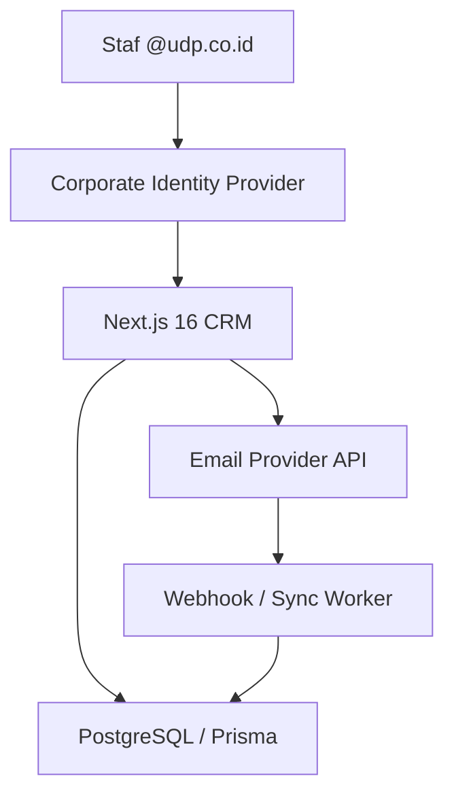
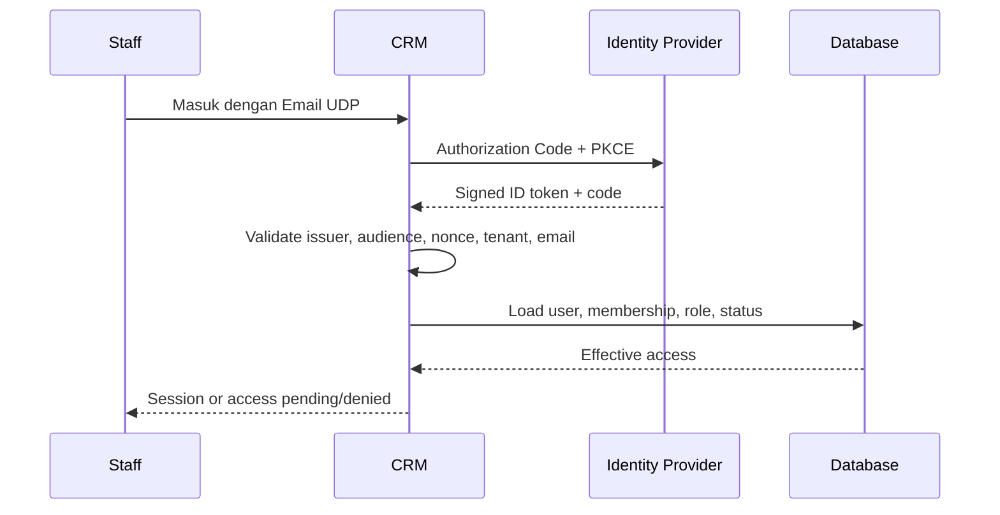
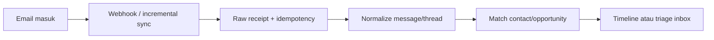

# Corporate SSO & Email Integration Specification

Dokumen ini menjadi spesifikasi utama untuk:

1. login user staf menggunakan akun perusahaan `@udp.co.id`;
2. pengelolaan lifecycle akun, session, role, dan brand scope;
3. koneksi mailbox perusahaan/brand ke CRM;
4. pencatatan email inbound dan outbound ke timeline lead;
5. keamanan, audit, testing, dan rollout integrasi email.

Dokumen terkait:

- [Dokumen 01 — Product Requirements](01_PRD_Business_Requirements_Multi_Brand_CRM.md)
- [Dokumen 02 — Technical Architecture](02_Technical_Architecture_Data_API_Multi_Brand_CRM.md)
- [Dokumen 03 — UX/UI Workflows](03_UX_UI_Workflows_Multi_Brand_CRM.md)
- [Dokumen 04 — Delivery, QA & Operations](04_Delivery_Roadmap_QA_Operations_Multi_Brand_CRM.md)

# 1. Keputusan Utama

| Area | Keputusan |
|---|---|
| Login staf | SSO/OIDC menggunakan akun perusahaan dengan alamat terverifikasi `@udp.co.id` |
| Password | CRM tidak membuat atau menyimpan password email staf |
| Validasi | Token, issuer, audience, tenant, verified email, domain, status user, dan membership wajib valid |
| Provisioning | Invitation atau JIT terkontrol; tidak ada akses otomatis hanya karena memiliki domain yang sama |
| Authorization | Role dan brand scope disimpan di CRM; domain email bukan permission |
| Login client | Realm terpisah, invitation-only, dibatasi company/project |
| Mailbox lead | Shared mailbox atau mailbox brand; personal mailbox tidak diambil secara default |
| Provider | Adapter untuk Google Workspace atau Microsoft 365; pilihan final mengikuti provider aktif UDP |
| Pengiriman | Email dikirim melalui provider API menggunakan sender identity brand yang sah |
| Timeline | Inbound, outbound, reply, attachment, delivery, bounce, dan assignment tercatat sebagai interaction |
| Audit | Login dan setiap tindakan penting terhadap akun/mailbox dapat ditelusuri |

> **Batas keamanan:** pengecekan string `@udp.co.id` saja tidak cukup. Penyerang dapat menulis alamat tersebut pada request palsu. Sistem harus memercayai hanya token yang ditandatangani identity provider perusahaan dan berasal dari tenant yang diizinkan.

# 2. Cakupan

## 2.1 Termasuk

- SSO user internal.
- Aktivasi, suspensi, dan pencabutan session staf.
- Role dan akses per brand.
- MFA policy untuk role sensitif.
- Shared mailbox per brand atau fungsi.
- Sinkronisasi email masuk dan terkirim.
- Reply dan compose dari CRM.
- Threading, attachment, delivery status, bounce, dan retry.
- Matching email ke contact, company, opportunity, project, quote, atau invoice.
- Inbox triage untuk pesan yang belum terhubung.
- Audit log, health monitoring, reconciliation, dan manual resync.

## 2.2 Tidak Termasuk pada MVP

- Mengarsipkan semua mailbox pribadi staf.
- Menggantikan aplikasi email perusahaan.
- Newsletter atau bulk marketing campaign skala besar.
- Kalender dan meeting synchronization.
- Automatic reply berbasis AI tanpa persetujuan user.
- Mengubah konfigurasi DNS email secara otomatis.
- Membaca email end-to-end encrypted yang tidak dapat didekripsi provider.

# 3. Identitas dan Realm Akses

| Realm | Pengguna | Identitas | Cara masuk | Scope |
|---|---|---|---|---|
| Internal | Super Admin, Direktur, Marketing, Finance, Production | Akun `@udp.co.id` | Corporate SSO | Organization, role, dan brand membership |
| Client portal | Client dan perwakilan company | Email yang diundang | Invitation + provider/passwordless sesuai keputusan | Company/project yang diberikan |
| Integration service | Worker dan webhook | Service identity | Secret/certificate terkelola | Endpoint dan mailbox tertentu |
| Emergency | Break-glass administrator | Akun khusus yang disetujui | MFA kuat dan prosedur darurat | Minimum access, semua aktivitas diaudit |

Internal dan client menggunakan session namespace, route, callback, dan authorization policy yang terpisah. User client tidak boleh memperoleh akses internal meskipun alamatnya kebetulan memakai domain `@udp.co.id`.

# 4. Arsitektur Konteks



Authentication dan mailbox integration boleh menggunakan provider yang sama, tetapi OAuth client, scopes, credential, dan audit-nya sebaiknya dipisahkan agar akses login tidak otomatis memberikan hak membaca mailbox.

# 5. Kebutuhan Corporate SSO

## 5.1 Authentication Flow



## 5.2 Validasi Wajib

Urutan validasi server-side:

1. `state`, `nonce`, dan PKCE verifier valid.
2. Authorization code ditukar melalui endpoint provider yang dikonfigurasi.
3. Signature token, algoritme, expiry, issuer, dan audience valid.
4. Tenant/directory identifier cocok dengan allowlist perusahaan.
5. Klaim email tersedia dan berstatus terverifikasi.
6. Email dinormalisasi menjadi lowercase dan domain sama persis dengan `udp.co.id`.
7. User CRM ditemukan atau memenuhi kebijakan provisioning.
8. User berstatus `ACTIVE` dan belum melewati `access_expires_at`.
9. Membership organisasi, role, dan sedikitnya satu brand scope tersedia.
10. Session baru dibuat dan login event dicatat.

## 5.3 Provisioning User

### Mode yang direkomendasikan untuk MVP

- Super Admin mengundang alamat `nama@udp.co.id`.
- Undangan membuat user `PENDING` dengan role dan brand scope yang telah ditentukan.
- Saat login SSO pertama, external identity diikat hanya jika email dan tenant cocok.
- Status berubah menjadi `ACTIVE` setelah binding berhasil.
- Invitation token memiliki expiry, single-use, dan tidak berisi permission sensitif dalam bentuk yang dapat dimodifikasi client.

### Fase lanjut

- Group-to-role mapping dari identity provider.
- SCIM/directory sync untuk joiner, mover, dan leaver.
- Approval workflow untuk role privileged.

JIT terbuka untuk seluruh akun `@udp.co.id` tidak direkomendasikan karena dapat membuat akun tanpa owner, role, atau brand scope yang terkontrol.

## 5.4 Lifecycle User

| State | Login | Session aktif | Penjelasan |
|---|---:|---:|---|
| `INVITED` | Terbatas pada activation flow | Tidak | Menunggu login pertama |
| `PENDING` | Tidak masuk aplikasi | Tidak | Menunggu role/brand approval |
| `ACTIVE` | Ya | Ya | Akses mengikuti effective permissions |
| `SUSPENDED` | Tidak | Dicabut | Suspensi manual atau insiden keamanan |
| `DEPROVISIONED` | Tidak | Dicabut | Staf keluar atau akun IdP dinonaktifkan |

Perubahan email, tenant identity, status, role, dan brand scope harus menghasilkan audit event. Penghapusan user tidak boleh menghapus histori aktivitas; record menggunakan soft-delete atau status deprovisioned.

## 5.5 Session Policy

- Cookie session wajib `HttpOnly`, `Secure`, dan memiliki `SameSite` sesuai kebutuhan callback OIDC.
- Session ID dirotasi setelah login, perubahan privilege, dan re-authentication.
- Idle timeout dan absolute timeout dapat dikonfigurasi; default awal yang disarankan adalah 30 menit idle untuk role privileged dan 8 jam absolute untuk staf.
- Re-authentication diperlukan untuk mengganti integration credential, mengubah role privileged, export data sensitif, serta tindakan keuangan berisiko.
- Semua session user dicabut saat user disuspend, deprovisioned, atau terjadi security incident.
- Logout lokal tidak dianggap cukup bila provider session masih aktif; UI harus menjelaskan perbedaan logout CRM dan logout account provider.

## 5.6 MFA dan Conditional Access

- MFA wajib diterapkan di identity provider untuk Super Admin, Direktur, Finance Approver, dan user yang dapat mengubah integrasi.
- Security key/passkey direkomendasikan untuk Super Admin dan emergency account.
- Conditional access berdasarkan device, lokasi, atau risiko login dikelola oleh identity provider bila tersedia.
- CRM menyimpan hasil/indikator autentikasi yang dibutuhkan untuk audit, tetapi tidak menyimpan faktor MFA.

# 6. Authorization Setelah Login

Effective access dihitung dari:

`organization membership + role permissions + brand scope + record ownership + field policy + resource state`

| Role | Akses email default |
|---|---|
| Super Admin | Konfigurasi koneksi dan audit; body email hanya bila memiliki permission eksplisit |
| Direktur | Read timeline lintas brand sesuai kebijakan; send tidak otomatis diberikan |
| Marketing | Read/reply/compose untuk brand dan lead yang diizinkan |
| Finance | Email quote/invoice/payment dari mailbox finance; financial fields sesuai permission |
| Production | Email project yang ditandai relevan untuk delivery; tidak otomatis melihat thread sales sensitif |
| Client | Tidak mengakses internal inbox; hanya komunikasi yang dipublikasikan atau dikirim melalui portal |

Permission minimum:

- `mailbox.configure`
- `mailbox.connect`
- `mailbox.disconnect`
- `email.read`
- `email.read_sensitive`
- `email.send`
- `email.send_finance`
- `email.assign`
- `email.link_record`
- `email.export`
- `email.resync`
- `audit.read`

# 7. Strategi Mailbox

## 7.1 Jenis Mailbox

| Jenis | Contoh penggunaan | Kebijakan |
|---|---|---|
| Shared brand mailbox | Sales atau inquiry sebuah brand | Pilihan utama untuk lead |
| Shared finance mailbox | Quote, invoice, payment | Dibatasi role Finance |
| Shared production mailbox | Project coordination | Dibatasi project/production scope |
| Personal staff mailbox | Komunikasi individual | Tidak diintegrasikan pada MVP kecuali ada kebutuhan dan persetujuan eksplisit |
| No-reply mailbox | Notification otomatis | Tidak digunakan untuk percakapan dua arah |

Alamat mailbox aktual ditetapkan saat discovery. Alamat login staf `nama@udp.co.id` tidak harus sama dengan sender email lead. Sender dapat menggunakan domain setiap brand selama mailbox, DNS, dan authorization provider telah dikonfigurasi.

## 7.2 Satu Koneksi per Provider Account

Setiap `MailboxConnection` harus menyimpan:

- organization dan brand owner;
- provider dan tenant/account ID;
- alamat email utama serta aliases;
- sender display name;
- capability yang disetujui;
- encrypted credential reference;
- sync cursor/subscription expiry;
- status health dan error terakhir;
- retention dan visibility policy;
- created/updated/disabled actor dan timestamp.

# 8. Email Inbound



## 8.1 Pipeline Pemrosesan

1. Provider mengirim webhook atau worker menjalankan incremental sync.
2. Sistem memverifikasi authenticity dan menyimpan receipt minimal.
3. Endpoint mengembalikan respons sukses secepatnya; parsing berat dilakukan worker.
4. Event didedup berdasarkan provider account, provider event ID, dan message ID.
5. Metadata dan body dinormalisasi; HTML disanitasi.
6. Attachment diambil hanya bila diizinkan policy, lalu dipindai dan disimpan.
7. Thread dicari dari provider thread ID dan email headers.
8. Participant dinormalisasi dan dicocokkan ke contact identities.
9. Opportunity/project candidate ditentukan dari thread link, recipient mailbox, subject token, dan konteks sebelumnya.
10. Pesan masuk ke timeline record atau `Unmatched Inbox` untuk triage manual.
11. Assignment, SLA first-response, notification, dan audit event dibuat.

## 8.2 Matching Priority

| Prioritas | Sinyal | Hasil |
|---:|---|---|
| 1 | Existing thread telah ditautkan | Gunakan contact dan business record yang sama |
| 2 | Reply token/reference internal valid | Tautkan ke record asal |
| 3 | Verified email identity cocok unik | Tautkan ke contact |
| 4 | Company domain dan recipient brand cocok | Tampilkan candidate, jangan auto-merge |
| 5 | Tidak ada kecocokan | Buat triage item, bukan langsung opportunity aktif |

Konflik identitas tidak boleh diselesaikan dengan auto-merge permanen. Marketing dapat memilih existing contact, membuat contact baru, atau meminta review.

## 8.3 Edge Cases Inbound

- Forwarded email tidak dianggap berasal dari alamat yang tertulis di body.
- Distribution list atau shared address tidak otomatis dianggap satu individu.
- Plus-addressing dan aliases dinormalisasi hanya berdasarkan konfigurasi domain.
- Satu email dengan beberapa client di `To/CC` dapat menghasilkan participant banyak tanpa membuat contact duplikat.
- Thread yang membahas dua project harus dapat di-split/link secara manual tanpa mengubah email asli.
- Auto-reply, out-of-office, bounce, dan spam diberi classification terpisah serta tidak memenuhi SLA response client.
- Email yang terlalu besar atau attachment ditolak provider tetap menghasilkan delivery/error record bila informasinya tersedia.

# 9. Email Outbound

## 9.1 Compose dan Reply

Sebelum mengirim, UI dan API wajib memvalidasi:

- user memiliki `email.send` pada brand dan mailbox terkait;
- sender mailbox aktif dan sehat;
- `From`, `Reply-To`, recipient, CC/BCC, subject, dan record context valid;
- template dan variable tidak menyisakan placeholder kosong;
- attachment lolos size, file type, malware, dan access policy;
- consent/opt-out sesuai jenis pesan;
- invoice/quote yang dilampirkan adalah versi issued yang benar;
- idempotency key belum pernah digunakan.

Outbound record disimpan sebelum request provider. Status minimal: `DRAFT`, `QUEUED`, `SENDING`, `SENT`, `DELIVERED`, `BOUNCED`, `FAILED`, `CANCELLED`.

## 9.2 Threading

- Reply mempertahankan subject yang tepat serta `In-Reply-To` dan `References`.
- Provider thread ID disimpan tetapi tidak menjadi satu-satunya sumber kebenaran.
- Pesan keluar yang dikirim langsung dari shared mailbox di luar CRM harus masuk melalui sync dan direkonsiliasi ke thread yang sama.
- Edit terhadap pesan `SENT` dilarang; koreksi dikirim sebagai pesan baru.

## 9.3 Sender Identity dan Brand Safety

- Composer selalu menampilkan brand, display name, alamat pengirim, recipient, serta visibility.
- User tidak dapat memilih mailbox di luar brand scope.
- Template signature, footer legal, logo, language, dan reply-to berasal dari konfigurasi brand.
- Finance email menggunakan sender dan template khusus Finance bila diwajibkan kebijakan.

# 10. Provider Adapter

Interface logis yang harus disediakan:

```ts
interface EmailProviderAdapter {
  authorize(input: AuthorizationRequest): Promise<AuthorizationResult>;
  refreshCredential(connectionId: string): Promise<void>;
  createSubscription(connectionId: string): Promise<SubscriptionResult>;
  renewSubscription(connectionId: string): Promise<SubscriptionResult>;
  incrementalSync(connectionId: string, cursor?: string): Promise<SyncBatch>;
  getMessage(connectionId: string, providerMessageId: string): Promise<NormalizedEmail>;
  sendMessage(input: SendEmailCommand): Promise<SendResult>;
  getAttachment(input: AttachmentRequest): Promise<BinaryResult>;
  revoke(connectionId: string): Promise<void>;
}
```

| Provider | Authentication | Mail API pattern | Catatan implementasi |
|---|---|---|---|
| Google Workspace | Google OIDC/OAuth 2.0 | Gmail API + push/incremental history | Verifikasi Workspace/domain dan renewal subscription |
| Microsoft 365 | Entra ID OIDC/OAuth 2.0 | Microsoft Graph + change notification/delta | Verifikasi tenant dan subscription expiry |

Gunakan least-privilege scopes dan pisahkan aplikasi OAuth untuk login dengan aplikasi/integration credential untuk mailbox bila memungkinkan.

# 11. Data Model

## 11.1 Entitas Authentication

| Entity | Field penting | Aturan |
|---|---|---|
| `User` | id, email_normalized, name, status, locale, timezone, access_expires_at | Email unik per organization |
| `ExternalIdentity` | user_id, provider, issuer, tenant_id, subject, email_verified | Unique provider + issuer + subject |
| `Membership` | user_id, organization_id, brand_id?, department, status | Menentukan organizational scope |
| `RoleAssignment` | user_id, role_id, brand_id?, valid_from, valid_until | Perubahan diaudit |
| `AuthSession` | user_id, token_hash, issued_at, last_seen_at, expires_at, revoked_at | Token mentah tidak disimpan |
| `LoginAudit` | user_id?, email_hash, result, reason, IP metadata, user_agent, correlation_id | Body/token tidak dicatat |

## 11.2 Entitas Email

| Entity | Field penting | Aturan |
|---|---|---|
| `MailboxConnection` | organization_id, brand_id, provider, tenant_id, address, aliases, status | Unique provider account + address |
| `ProviderCredential` | mailbox_id, encrypted_reference, scopes, expires_at, rotated_at | Tidak pernah dikirim ke browser |
| `EmailThread` | mailbox_id, provider_thread_id, subject_normalized, last_message_at | Dapat ditautkan ke beberapa record dengan policy |
| `EmailMessage` | thread_id, provider_message_id, message_id_header, direction, subject, body refs, sent_at, received_at, status | Idempotent unique key |
| `EmailParticipant` | message_id, type, address_normalized, display_name, contact_id? | Type: from/to/cc/bcc/reply-to |
| `EmailAttachment` | message_id, file_id, filename, mime_type, size, scan_status | Download selalu authorized |
| `EmailRecordLink` | thread/message_id, contact/company/opportunity/project/invoice ID, link_type | History link diaudit |
| `EmailDeliveryEvent` | message_id, provider_event_id, type, occurred_at, diagnostic | Dedup event provider |
| `MailboxSyncCursor` | mailbox_id, cursor, subscription_id, expires_at, last_success_at | Update transactional |
| `WebhookReceipt` | provider, account_id, event_id, received_at, payload_hash, status | Payload sensitif dibatasi retensinya |

## 11.3 Integrity Rules

- `User.email_normalized` harus lowercase dan menggunakan canonical Unicode/domain handling.
- `ExternalIdentity.subject` adalah identity key utama; email dapat berubah.
- `EmailMessage` unique pada `mailbox_id + provider_message_id` dan, bila tersedia, `mailbox_id + message_id_header`.
- `WebhookReceipt` unique pada `provider + account_id + event_id`.
- Token OAuth disimpan terenkripsi menggunakan envelope encryption/KMS reference.
- Hard delete email/thread tidak dilakukan dari workflow biasa; gunakan retention purge yang terkontrol.

# 12. API Contract

Base path: `/api/v1`. Semua mutation menggunakan authorization server-side, correlation ID, audit context, dan idempotency key bila relevan.

## 12.1 Authentication dan User Administration

| Method | Endpoint | Fungsi |
|---|---|---|
| `GET` | `/auth/signin/udp` | Memulai SSO staf |
| `GET` | `/auth/callback/{provider}` | Callback OIDC tervalidasi |
| `POST` | `/auth/logout` | Mencabut session aktif |
| `GET` | `/api/v1/me` | Profil, role, permission, dan brand scope efektif |
| `POST` | `/api/v1/admin/users/invitations` | Mengundang user `@udp.co.id` |
| `PATCH` | `/api/v1/admin/users/{id}` | Mengubah status, profile, expiry |
| `PUT` | `/api/v1/admin/users/{id}/roles` | Mengatur role dan scope |
| `POST` | `/api/v1/admin/users/{id}/revoke-sessions` | Mencabut seluruh session |

## 12.2 Mailbox dan Email

| Method | Endpoint | Fungsi |
|---|---|---|
| `GET` | `/api/v1/mailboxes` | Daftar mailbox sesuai permission |
| `POST` | `/api/v1/mailboxes/connect` | Memulai admin consent/OAuth |
| `POST` | `/api/v1/mailboxes/{id}/disconnect` | Menonaktifkan koneksi |
| `POST` | `/api/v1/mailboxes/{id}/resync` | Menjalankan reconciliation terbatas |
| `GET` | `/api/v1/mailboxes/{id}/health` | Status token, subscription, sync, dan error |
| `GET` | `/api/v1/email/threads` | Filter thread berdasarkan brand/record/status |
| `GET` | `/api/v1/email/threads/{id}` | Detail thread yang terotorisasi |
| `POST` | `/api/v1/email/messages` | Compose email baru |
| `POST` | `/api/v1/email/threads/{id}/reply` | Reply pada thread |
| `POST` | `/api/v1/email/messages/{id}/link` | Link ke contact/opportunity/project |
| `POST` | `/api/v1/email/messages/{id}/assign` | Assign owner/team |
| `POST` | `/api/v1/webhooks/email/{provider}` | Menerima provider event |

API tidak mengembalikan credential, raw access token, refresh token, atau provider secret.

# 13. Jobs dan Event

| Job/Event | Trigger | Idempotency | Failure handling |
|---|---|---|---|
| `auth.user.logged_in` | SSO success | session ID | Audit write wajib |
| `auth.user.deprovisioned` | Admin/directory sync | user + version | Revoke sessions |
| `mail.webhook.received` | Provider webhook | provider event ID | Store then queue |
| `mail.sync.incremental` | Webhook/schedule | mailbox + cursor | Retry with backoff |
| `mail.message.normalize` | Raw message available | mailbox + message ID | Dead-letter after limit |
| `mail.identity.resolve` | Normalized participant | message + identity version | Manual triage on conflict |
| `mail.send.requested` | User/API action | idempotency key | Reconcile unknown result |
| `mail.delivery.updated` | Provider event | provider event ID | Append status history |
| `mail.subscription.renew` | Before expiry | mailbox + period | Alert before expiration |

# 14. Security dan Privacy

## 14.1 Credential dan Secret

- Secret hanya berada di server-side secret manager.
- OAuth refresh token dienkripsi dan tidak dicatat pada logs.
- Key rotation dan credential revocation memiliki SOP.
- Development, staging, dan production menggunakan OAuth app serta credential terpisah.
- Webhook signature/client state diverifikasi sebelum event diterima.

## 14.2 Email Content

- HTML email disanitasi sebelum render; script, active content, dan remote tracking diblokir atau diproxy sesuai kebijakan.
- Attachment dipindai malware dan diperiksa MIME, extension, size, serta access permission.
- Download attachment memakai authorization per request dan signed URL singkat.
- Search index tidak boleh membuat email lintas brand dapat ditemukan.
- Log teknis tidak menyimpan body, attachment, token, atau alamat lengkap jika tidak diperlukan.
- Export email memerlukan permission, reason, audit, expiry, dan watermark bila kebijakan meminta.

## 14.3 Domain Email

SPF, DKIM, dan DMARC untuk sender domain perlu dikonfigurasi oleh administrator email/DNS. CRM hanya menampilkan health/status yang dapat diperoleh dari provider atau verifikasi terpisah; CRM tidak boleh mengubah DNS tanpa change request yang disetujui.

## 14.4 Retention

Retention ditentukan berdasarkan legal, kontrak client, dan kebijakan perusahaan. Sistem harus mendukung:

- retention per mailbox/brand;
- legal hold bila diperlukan;
- purge attachment dan body secara terkontrol;
- mempertahankan audit metadata minimum;
- pengecualian untuk dispute, invoice, atau project aktif;
- backup lifecycle yang konsisten dengan purge policy.

# 15. UX Requirements

## 15.1 Login

- Hanya satu CTA utama: **Masuk dengan Email UDP**.
- Tidak ada field password CRM untuk staf.
- State wajib: loading redirect, callback processing, access pending, wrong domain, wrong tenant, suspended, expired session, dan provider unavailable.
- Error tidak mengungkap apakah alamat tertentu terdaftar, kecuali kepada user yang telah berhasil diautentikasi.
- Correlation ID dan kontak bantuan internal ditampilkan pada error yang dapat dieskalasi.

## 15.2 Email Timeline

- Setiap item menampilkan direction, sender, recipient ringkas, subject, timestamp, mailbox/brand, status, owner, dan visibility.
- Body panjang collapsed secara default; quoted history dan signature dapat disembunyikan.
- Badge membedakan inbound, sent, delivered, bounced, internal note, dan automated reply.
- User dapat memfilter channel Email saja tanpa memutus urutan kronologis seluruh interaction.
- Link ke contact, opportunity, project, quote, atau invoice terlihat dan dapat dikoreksi sesuai permission.

## 15.3 Composer

- Sender brand dan mailbox tidak boleh tersembunyi.
- Reply mempertahankan thread; compose baru meminta subject.
- Recipient suggestion hanya mengambil data yang boleh dilihat user.
- Template dapat difilter berdasarkan brand, layanan, pipeline stage, bahasa, dan use case.
- Preview memperlihatkan signature dan attachment final.
- Double submit dicegah dengan disabled state dan idempotency key.

## 15.4 Admin Integration Health

Super Admin melihat:

- mailbox status `CONNECTED`, `DEGRADED`, `EXPIRED`, atau `DISCONNECTED`;
- waktu sync sukses terakhir;
- cursor/subscription expiry;
- queue lag, failed message, dan dead-letter count;
- credential expiry tanpa menampilkan token;
- tombol reconnect, resync terbatas, disable, dan audit history.

# 16. Error Handling dan Recovery

| Kondisi | Respons sistem | Aksi operator |
|---|---|---|
| Wrong domain/tenant | Tolak login, audit reason | Verifikasi akun dan tenant |
| User aktif di IdP tetapi belum diundang | Halaman pending | Super Admin menetapkan membership |
| User dinonaktifkan | Revoke session dan tolak akses | Review HR/IT status |
| OAuth token expired | Refresh otomatis | Reconnect bila refresh gagal |
| Subscription expired | Scheduled renewal dan alert | Recreate subscription |
| Webhook terlambat/hilang | Incremental reconciliation | Resync dari cursor terakhir |
| Provider timeout saat send | Status unknown/pending reconciliation | Jangan langsung resend |
| Duplicate webhook | Abaikan secara idempotent | Tidak ada |
| Identity conflict | Masuk triage | Marketing memilih contact |
| Attachment berbahaya | Quarantine dan warning | Security review |
| Mailbox disconnected | Block new send, pertahankan history | Admin reconnect |

# 17. Observability dan Audit

## 17.1 Metrics

- SSO success/failure per reason.
- Pending user count dan deprovision lag.
- Active/revoked session count.
- Webhook receipt rate dan verification failures.
- Email ingestion latency p50/p95/p99.
- Queue lag, retry, dead-letter, dan duplicate suppression.
- Send success, bounce, reject, dan unknown outcome.
- Unmatched inbound rate dan identity conflict rate.
- Mailbox sync age dan subscription expiry horizon.

## 17.2 Audit Events

- Login success/failure, logout, session revoke.
- User invitation, activation, suspension, deprovision.
- Role, brand scope, MFA requirement, dan access expiry changes.
- Mailbox connect, reconnect, disconnect, credential rotation, resync.
- Email read sensitif, send, export, link/unlink, reassign, delete/purge.
- Template dan sender identity changes.

Audit entry berisi actor, action, resource, timestamp UTC, result, reason, source, correlation ID, serta before/after yang telah direduksi dari secret dan body sensitif.

# 18. Non-Functional Requirements

| Area | Target baseline |
|---|---|
| Availability login | Mengikuti provider; aplikasi memberi error yang dapat ditindaklanjuti saat provider unavailable |
| Webhook acknowledgement | Kurang dari 5 detik pada kondisi normal |
| Inbound visibility | p95 kurang dari 60 detik setelah event diterima |
| Send request | Tidak double-send pada retry/client refresh |
| Reconciliation | Dapat melanjutkan dari cursor terakhir tanpa duplikat |
| Authorization | Semua read/download/send diuji lintas role dan brand |
| Audit | 100% privileged changes dan send events memiliki audit record |
| Recovery | Mailbox dapat reconnect/resync tanpa kehilangan existing timeline |
| Accessibility | Login, inbox, composer, dan error dapat digunakan dengan keyboard dan screen reader |
| Localization | Timestamp mengikuti timezone user; canonical storage tetap UTC |

# 19. Acceptance Criteria

## 19.1 Corporate SSO

- [ ] User aktif yang diundang dengan email `@udp.co.id` dapat login melalui corporate identity provider.
- [ ] Email dengan domain lain ditolak dari internal realm.
- [ ] Token dengan issuer, audience, tenant, signature, nonce, atau expiry salah ditolak.
- [ ] User `PENDING`, `SUSPENDED`, atau `DEPROVISIONED` tidak memperoleh data aplikasi.
- [ ] Login tidak otomatis memberikan role atau akses semua brand.
- [ ] Perubahan role dan brand scope berlaku pada request berikutnya atau setelah session refresh yang aman.
- [ ] Deprovision mencabut seluruh session aktif.
- [ ] Client invitation tidak dapat digunakan untuk membuka internal app.
- [ ] Semua hasil login dan privilege change masuk audit log.

## 19.2 Email Integration

- [ ] Email baru pada mailbox pilot muncul satu kali pada CRM timeline atau triage inbox.
- [ ] Reply dari CRM memakai sender brand yang benar dan mempertahankan thread.
- [ ] Email yang dikirim langsung dari shared mailbox dapat direkonsiliasi ke CRM.
- [ ] Attachment hanya dapat dibuka oleh role dan brand yang berhak.
- [ ] Bounce/delivery status memperbarui message tanpa membuat message baru.
- [ ] Duplicate webhook atau retry tidak menyebabkan duplicate interaction atau double-send.
- [ ] Unmatched email dapat ditautkan manual ke contact dan opportunity dengan audit trail.
- [ ] User tanpa `email.send` tidak dapat mengirim melalui UI maupun API.
- [ ] Mailbox disconnected tidak menghapus history lama.
- [ ] Resync dari cursor/checkpoint tidak menghasilkan duplikasi.

# 20. Test Matrix Minimum

| ID | Scenario | Expected result |
|---|---|---|
| AUTH-01 | Valid invited `@udp.co.id` user | Login berhasil sesuai role/brand |
| AUTH-02 | Valid SSO tetapi domain berbeda | Ditolak sebelum session dibuat |
| AUTH-03 | Domain benar tetapi tenant salah | Ditolak dan diaudit |
| AUTH-04 | Token replay/nonce salah | Ditolak |
| AUTH-05 | Suspended user memiliki session lama | Session tidak dapat digunakan |
| AUTH-06 | Marketing mencoba halaman Super Admin | Server mengembalikan forbidden |
| AUTH-07 | Client mencoba internal callback/route | Tidak memperoleh internal session |
| MAIL-01 | Inbound new lead | Triage item dan SLA dibuat |
| MAIL-02 | Existing email contact | Timeline contact/opportunity diperbarui |
| MAIL-03 | Same person previously via WhatsApp | Satu contact, dua channel identities |
| MAIL-04 | Duplicate provider webhook | Satu EmailMessage/Interaction |
| MAIL-05 | Reply with attachment | Thread, file, send, dan audit valid |
| MAIL-06 | User selects unauthorized brand sender | Request ditolak server-side |
| MAIL-07 | Provider timeout after send | Reconciliation; tidak auto double-send |
| MAIL-08 | Malicious HTML/script | Disanitasi sebelum render |
| MAIL-09 | Malware attachment | Quarantine; download diblokir |
| MAIL-10 | Cross-brand search/download | Tidak ada metadata atau file leak |
| MAIL-11 | Subscription expires | Renewal atau alert sebelum kehilangan sync |
| MAIL-12 | Disconnect and reconnect | History tetap ada; sync lanjut aman |

# 21. Rollout Plan

## Fase 0 — Discovery

- Konfirmasi provider email aktif UDP: Google Workspace, Microsoft 365, atau lainnya.
- Inventaris tenant ID, domain aliases, MFA policy, user directory, dan admin owner.
- Tentukan mailbox per brand/fungsi, volume, retention, serta legal/privacy policy.
- Konfirmasi sender domain, DNS ownership, SPF/DKIM/DMARC, dan email aliases.
- Pilih dua sampai lima user serta satu mailbox untuk pilot.

## Fase 1 — Corporate SSO

- Buat OAuth/OIDC application untuk environment development dan staging.
- Implement tenant/domain validation, invitation, membership, role, dan audit.
- Jalankan negative tests dan privileged MFA test.
- Pilot staf internal sebelum membuka email content.

## Fase 2 — Read-Only Mailbox Pilot

- Hubungkan satu shared mailbox.
- Ingest email tanpa fitur send.
- Validasi threading, matching, attachment, visibility, dan reconciliation.
- Ukur duplicate, unmatched, latency, serta operator triage load.

## Fase 3 — Controlled Send

- Aktifkan reply/compose untuk user pilot.
- Batasi mailbox, brand, template, dan volume.
- Pantau send failure, bounce, double-send, dan user error.

## Fase 4 — Brand Expansion

- Tambah mailbox secara bertahap per brand.
- Training Marketing, Finance, dan Production.
- Review KPI setelah tujuh dan tiga puluh hari.
- Aktifkan automation setelah data dan delivery stabil.

# 22. Configuration Checklist

Nilai berikut tidak boleh di-hardcode dan secret tidak boleh dimasukkan ke repository:

| Configuration | Contoh placeholder |
|---|---|
| Allowed staff domain | `udp.co.id` |
| OIDC issuer | `<corporate-issuer-url>` |
| OIDC client ID | `<secret-manager-reference>` |
| OIDC tenant ID | `<approved-tenant-id>` |
| OIDC redirect URI | `https://<crm-domain>/auth/callback/<provider>` |
| Mail provider | `google-workspace` atau `microsoft-365` |
| Webhook public URL | `https://<crm-domain>/api/v1/webhooks/email/<provider>` |
| Webhook verification secret | `<secret-manager-reference>` |
| Encryption key | `<kms-key-reference>` |
| Queue name | `<environment>-email-events` |
| Object storage bucket | `<environment>-crm-attachments` |
| Retention policy | `<approved-policy-id>` |

# 23. Keputusan yang Masih Harus Dikonfirmasi

| ID | Pertanyaan | Owner | Dampak |
|---|---|---|---|
| OD-EMAIL-01 | Provider `udp.co.id` menggunakan Google Workspace, Microsoft 365, atau provider lain? | IT Admin | Menentukan adapter dan consent flow |
| OD-EMAIL-02 | Apakah semua staf telah memiliki MFA? | IT Admin | Security gate produksi |
| OD-EMAIL-03 | Shared mailbox apa saja yang digunakan tiap brand? | Marketing Lead | Routing dan brand scope |
| OD-EMAIL-04 | Apakah pengiriman menggunakan domain UDP, domain brand, atau keduanya? | Direktur + IT | Sender identity dan DNS |
| OD-EMAIL-05 | Apakah personal mailbox perlu terhubung pada fase lanjut? | Direktur + Legal/HR | Privacy dan permission |
| OD-EMAIL-06 | Berapa lama body email dan attachment disimpan? | Legal + IT | Retention dan storage |
| OD-EMAIL-07 | Apakah client login juga memakai social/OIDC atau passwordless email link? | Product Owner | Portal authentication |
| OD-EMAIL-08 | Group IdP mana yang dipetakan ke role CRM? | Super Admin | Provisioning automation |

# 24. Definition of Done

Integrasi dianggap siap production bila:

- seluruh acceptance criteria P0 lulus;
- corporate tenant, domain, MFA, role, dan brand isolation telah diuji;
- tidak ada token atau body email sensitif pada log;
- webhook, incremental sync, idempotency, retry, dan reconciliation stabil;
- shared mailbox pilot dapat menerima dan mengirim tanpa duplicate interaction;
- security review, UAT, SOP reconnect, incident response, dan rollback disetujui;
- owner operasional, dashboard health, alert, dan escalation path tersedia;
- keputusan terbuka yang memblokir production telah ditutup dan dicatat sebagai ADR/change record.
